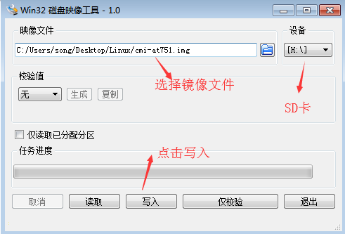
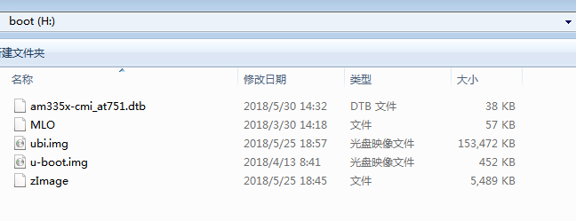

## jCMI_AT751 源代码编译说明


### 一、准备一个Ubuntu14.04 的虚拟机
* 安装相关软件
```sh
  sudo apt-get update
  sudo apt-get install git vim
```

###  二、源代码下载：
* Uboot2016.05 下载
```sh
  cd ~
  mkdir aplex
  cd aplex
  mkdir uboot2016.05
  cd uboot2016.05
  git init
  git pull https://github.com/AplexOS/U-Boot  CMI_AT751-Linux-Uboot-v2016.05:master
```

* Kernel4.4.12 下载
```sh
  cd ~/aplex  &&  mkdir kernel4.4.12
  cd ~/aplex/kernel4.4.12 && git init
  git pull https://github.com/AplexOS/Linux-Kernel  CMI_AT751-Linux-Kernel-v4.4.12:master
```

* filesystem 下载
```sh
  cd ~/aplex && mkdir filesystem
  cd ~/aplex/filesystem
  # u ubuntu 的 root 首次要自己配置一个， 命令如下：
  sudo passwd root
  su
  # su 是升级为 root 用户的命令
  # 以下操作请在 root 下运行
  git init
  git pull  https://github.com/scw-92/cmi_at751_rootfs  master:master
  exit
  # exit 是退出 root 用户的命令
```

### 三、 交叉编译环境搭建
*  交叉编译器下载
  [CrossCompiler](https://releases.linaro.org/components/toolchain/binaries/5.3-2016.02/arm-linux-gnueabihf/gcc-linaro-5.3-2016.02-x86_64_arm-linux-gnueabihf.tar.xz)

* 下载完了将它放入虚拟机 ~/aplex 目录，并解压:
```sh
  cd  ~/aplex
  tar -xvf  gcc-linaro-5.3-2016.02-x86_64_arm-linux-gnueabihf.tar.xz
```
* 配置交叉编译器路径：
```sh
  aplex@Aplex:~/aplex$ cat ~/.bashrc
  [...省略前面无关内容]
  export PATH=~/aplex/gcc-linaro-5.3-2016.02-x86_64_arm-linux-gnueabihf/bin:$PATH
  export ARCH=arm
  export CROSS_COMPILE=arm-linux-gnueabihf-
  aplex@Aplex:~$
```
* 测试交叉编译器是否正常：
```sh
  aplex@Aplex:~/aplex$ source ~/.bashrc
  aplex@Aplex:~/aplex$ arm             # <---------- 这里按两次Tab键看效果
  arm2hpdl                        arm-linux-gnueabihf-gcov-tool
  arm-linux-gnueabihf-addr2line   arm-linux-gnueabihf-gdb
  arm-linux-gnueabihf-ar          arm-linux-gnueabihf-gfortran
  arm-linux-gnueabihf-as          arm-linux-gnueabihf-gprof
  arm-linux-gnueabihf-c++         arm-linux-gnueabihf-ld
  arm-linux-gnueabihf-c++filt     arm-linux-gnueabihf-ld.bfd
  arm-linux-gnueabihf-cpp         arm-linux-gnueabihf-nm
  arm-linux-gnueabihf-elfedit     arm-linux-gnueabihf-objcopy
  arm-linux-gnueabihf-g++         arm-linux-gnueabihf-objdump
  arm-linux-gnueabihf-gcc-5.3.1   arm-linux-gnueabihf-readelf
  arm-linux-gnueabihf-gcc-ar      arm-linux-gnueabihf-size
  arm-linux-gnueabihf-gcc-nm      arm-linux-gnueabihf-strings
  arm-linux-gnueabihf-gcc-ranlib  arm-linux-gnueabihf-strip
  arm-linux-gnueabihf-gcov

  aplex@Aplex:~/aplex$ arm
```

## 四、源代码的编译，ubi 文件系统的生成：
* u-boot2016.05 编译：
```sh
  cd ~/aplex/u-boot2016.05
  make -j2 O=out  am335x_cmi_at751_defconfig all
  cp out/MLO ~/image -rf
  cp out/u-boot.img  ~/image -rf
 # 已经将生成的 MLO、u-boot.img 拷贝到 ~/image 目录下
```
* kernel4.4.12 编译：
```sh
  cd ~/aplex/kernel4.4.12
  make  cmi_at751_defconfig
  make all -j4
  cp arch/arm/boot/zImage  ~/image -rf
  cp arch/arm/boot/dts/am335x-cmi_at751.dtb  ~/image -rf
  # 生成的 zImage am335x-cmi_at151.dtb 放在了 ~/image 下面。
```
* ubi 文件系统的生成：
```shell
  cd  ~/aplex/filesytem/
  sudo apt-get install mtd-utils
  sudo chmod 777 mkubiimg.sh  ubinize.cfg
  ./mkubiimg.sh
  #  生成的 ubi.img 也放在了 ~/image 下面。
```

## 五、SD卡的制作：
* 安装必要的工具：
```sh
  sudo apt-get install kpartx
  sudo apt-get install mtd-utils
```
* 制作300M大小的IMG文件：
```sh
  sudo dd if=/dev/zero of=cmi_at751.img  bs=1M count=300
```
* 使用losetup命令将此文件转化为loop device：
```sh
  sudo losetup -f --show cmi_at751.img
  # 此命令会显示你挂载到哪个设备节点下，一般为 /dev/loop0 ,1 ,2, 3...7
```
* 通过 fdisk 命令对磁盘文件进行分区：
```sh
  sudo fdisk  /dev/loop0  #（假设cmi_at751.img文件的挂载点是dev/loop0）
    Device contains neither a valid DOS partition table, nor Sun, SGI or OSF disklabel
    Building a new DOS disklabel with disk identifier 0x2e7df78e.
    Changes will remain in memory only, until you decide to write them.
    After that, of course, the previous content won't be recoverable.

    Warning: invalid flag 0x0000 of partition table 4 will be corrected by w(rite)

    Command (m for help): n                             # 新建一个分区
    Partition type:
       p   primary (0 primary, 0 extended, 4 free)
       e   extended
    Select (default p): p                               # 主分区
    Partition number (1-4, default 1): 1                #  分区号
    First sector (2048-409599, default 2048):           #  默认2048
    Using default value 2048
    Last sector, +sectors or +size{K,M,G} (2048-409599, default 409599): +250M
                                                        # 给第一个分区250M大小
    Command (m for help): n                             # 新建一个分区
    Partition type:
       p   primary (1 primary, 0 extended, 3 free)
       e   extended
    Select (default p): p                               # 主分区
    Partition number (1-4, default 2):                  # 使用默认的2
    Using default value 2                    
    First sector (63488-409599, default 63488):         # 使用默认值  
    Using default value 63488
    Last sector, +sectors or +size{K,M,G} (63488-409599, default 409599):     # 直接到结束
    Using default value 409599                

    Command (m for help): t                             # 改变分区属性
    Partition number (1-4): 1                           # 改变第1个分区
    Hex code (type L to list codes): e                  # 改为FAT16类型的文件系统
    Changed system type of partition 1 to e (W95 FAT16 (LBA))

    Command (m for help): a                             # 增加boot 属性
    Partition number (1-4): 1                           # 指定第一个分区增加boot 属性

    ommand (m for help): w                              # 保存相关信息
    The partition table has been altered!

    Calling ioctl() to re-read partition table.

    WARNING: Re-reading the partition table failed with error 22: Invalid argument.
    The kernel still uses the old table. The new table will be used at
    the next reboot or after you run partprobe(8) or kpartx(8)

    WARNING: If you have created or modified any DOS 6.x
    partitions, please see the fdisk manual page for additional
    information.
    Syncing disks.
```
* 使用kpartx命令来绑定磁盘分区：
```sh
  sudo kpartx -av /dev/loop0
```
* 对分区进行格式化：
```sh
  sudo mkfs.vfat    -n "boot" -F 16  /dev/mapper/loop0p1
  sudo mkfs.ext3    -L "rootfs"      /dev/mapper/loop0p2
```
* 挂载第一个分区，将文件系统等镜像文件拷贝到此分区中：
```sh
  sudo mount /dev/mapper/loop0p1  /mnt
  sudo cp  ~/image/*    /mnt   -rf
  sync
  ls /mnt
  # 镜像文件已经制作完毕，可将cmi_at751.img拷贝到windows操作系统进行后续操作
```
* 将img文件系统解除映射：
```sh
  sudo umount  /mnt
  sudo  kpartx -d /dev/loop0
  sudo  losetup -d /dev/loop0
```
* 将cmi_at751.img文件烧写到sd卡上：
  在windows平台上通过工具Win32DiskImager将img文件系统写到sd卡，如下图1和图2。
  
```sh
                                图一 镜像的烧写过程1
```
  
```sh
                                图二 被写进去的文件
```
