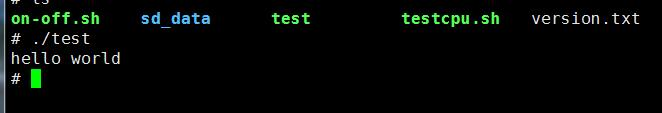

# CMI_AT151 软件交叉编译例程

## 一、 交叉编译环境
* 参考：[CROSS_COMPILE](CrossCompiler.md) 配置交叉编译环境
* 执行 `arm-linux-gnueabihf-gcc -v` 能看到交叉编译器版本信息

## 二、最简单的 `hello world` 程序交叉编译
* test.c
```
  #include <stdio.h>

  int main(void)
  {
      printf("hello world\n");
      return 0;
  }
```
* `arm-linux-gnueabihf-gcc test.c  -o test`
* 通过 FTP 将 test 文件放入 CMI_AT151上面
* 执行效果如下
  
