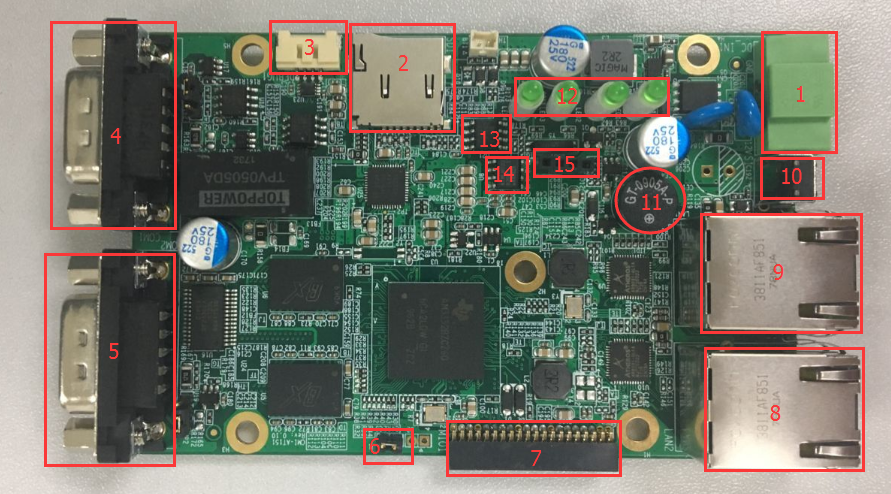
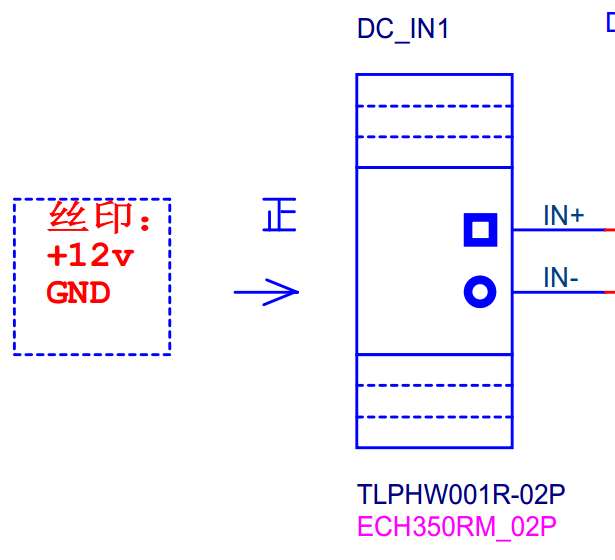
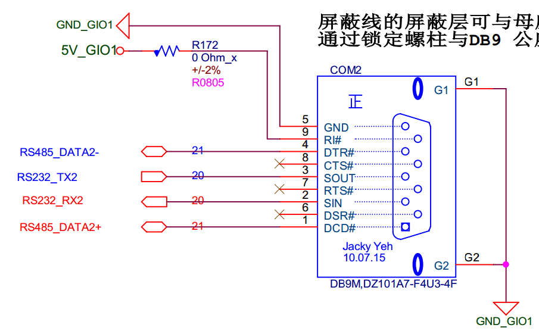

# CMI_AT151 硬件介绍

## 一、硬件如下图所示：
  

## 二、大致功能介绍：
1. DC_IN
2. TF
3. DEBUG
4. com1
5. COM2
6. J1
7. 扩展接口
8. LAN2
9. LAN1
10. RESET
11. BUZZER
12. LED
13. RTC
14. EEPROM
15. USB1

## 二、部分硬件原理图如下所示
* DEBUG
  
  * 这里是 TTL 的电平信号, 3.3V
* DC_IN
  
  * 1角是 12V输入，2角GND
* COM1
  
  * 这个 COM1 扩展了一路 RS232 一路 RS485 ， 他们用的都是同一个 UART，所以他们不能同时共用。
  * COM1 的软件设备节点是 `/dev/ttyO1`
* COM2  
  
  * 这个 COM1 扩展了一路 RS232 一路 RS485 ， 他们用的都是同一个 UART，所以他们不能同时共用。
  * COM2 的软件设备节点是 `/dev/ttyO2`
* USB1
  
