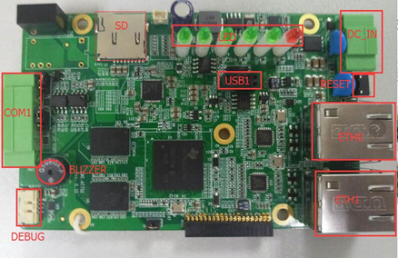
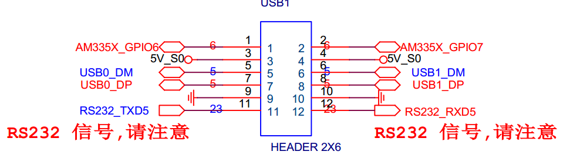
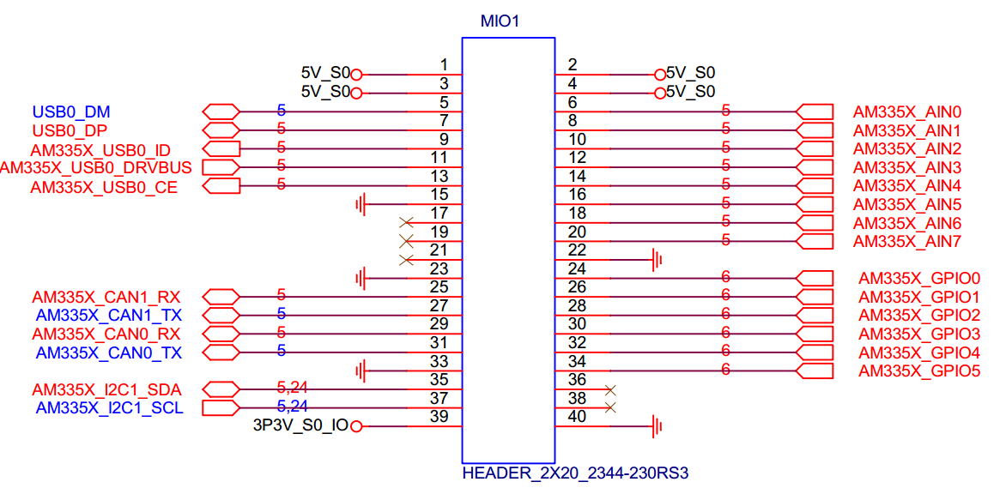

# CMI_AT752 硬件介绍

## 一、硬件如下图所示：
  

## 二、大致功能介绍：
* 9-36V DC_IN.
* 两路百兆有线网卡.
* COM1 上含有两路 RS-485.
* USB1 上含有1路 RS-232, 1路USB， 2路GPIO.
* Buzzer.
* Reset Button.
* 一路 RUN LED，4个RS-485 状态灯.
* SD .
* DS1337 RTC.
* 取消关闭功能的 watchdog.
* 一个扩展接口.

## 二、部分硬件原理图如下所示
* COM1 硬件原理图如下:
  
* DEBUG 硬件原理图如下:
  
* USB1 硬件原理图如下:
  
* 扩展接口：
  
