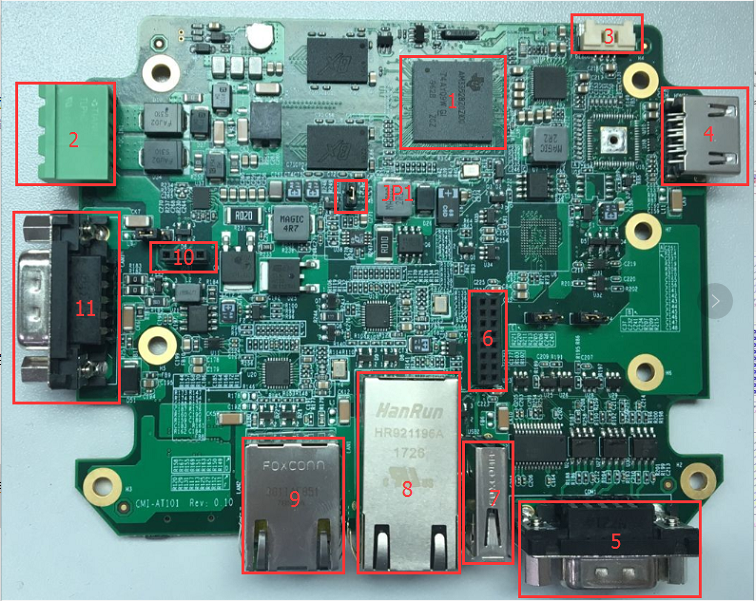
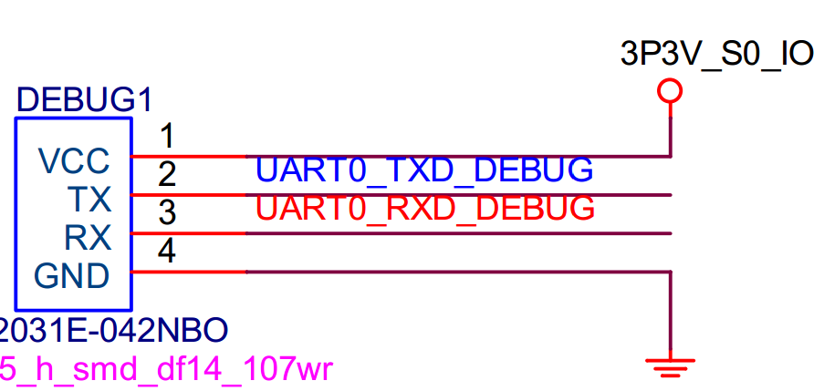
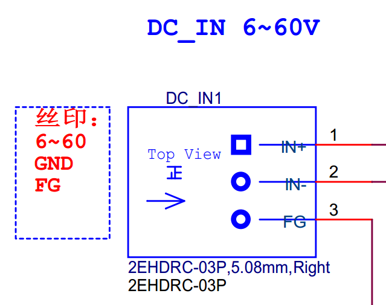
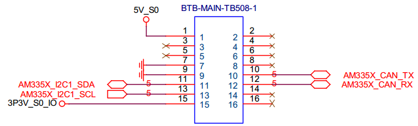
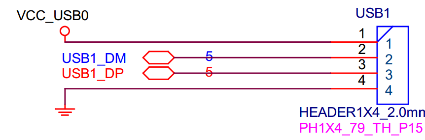

# CMI_AT101 硬件介绍

## 一、硬件如下图所示：
  

## 二、大致功能介绍：
1. AM3354
2. 6-60V 宽电压输入
3. DEBUG
4. HDMI
5. COM1
6. TB508
7. USB typeA
8. ETH0
9. ETH1
10. USB1
11. CAN1

## 二、部分硬件原理图如下所示
* DEBUG
  
  * 这里是 TTL 的电平信号, 3.3V
* DC_IN
  
  * 1角是 6-60V输入，2角GND
* COM1
  
  * 这个 DB9 扩展了 1 路 RS-232，1 路 RS-422，2路 RS-485
  * 其中，RS-422 与 其中一路 RS-485 共用一路 UART， 需要通过 GPIO 进行控制切换
* TB508
  
  * 这个扩展接口主要是扩展了一路 CAN, 主要配合 TB508 进行使用
* USB1
  
* CAN1
  
  * 2角是 CAN_L, CAN low
  * 7角是 CAN_H，CAN high
