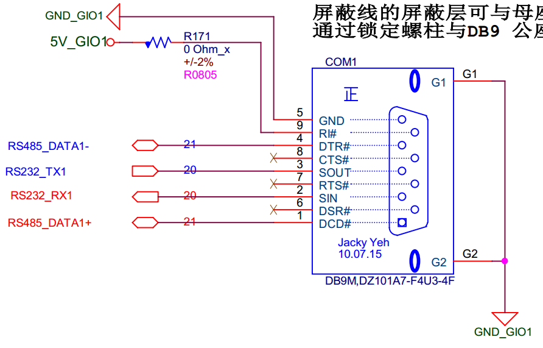

# ECM_5410 硬件介绍

## 一、硬件如下图所示：
  

## 二、大致功能介绍：
* 12V DC_IN.
* 四路百兆有线网卡.
* COM1 上含有2路 RS-485, 2路 RS-232
* COM3 上含有8路 RS-485
* COM4 上面有 1 路 CAN, 4 路DI DO
* J3 上含有2路USB2.0, 4 路 GPIO。
* Reset Button.
* SD .
* DS1337 RTC.
* 取消关闭功能的 watchdog.
* RS-232 DEBUG
* AT24C02 EEPROM

## 二、部分硬件原理图如下所示
* COM1 硬件原理图如下:
    
* COM3 硬件原理图如下:
    
* COM4 硬件原理图如下:
  
* DEBUG 硬件原理图如下:
  
* USB1 硬件原理图如下:
  
