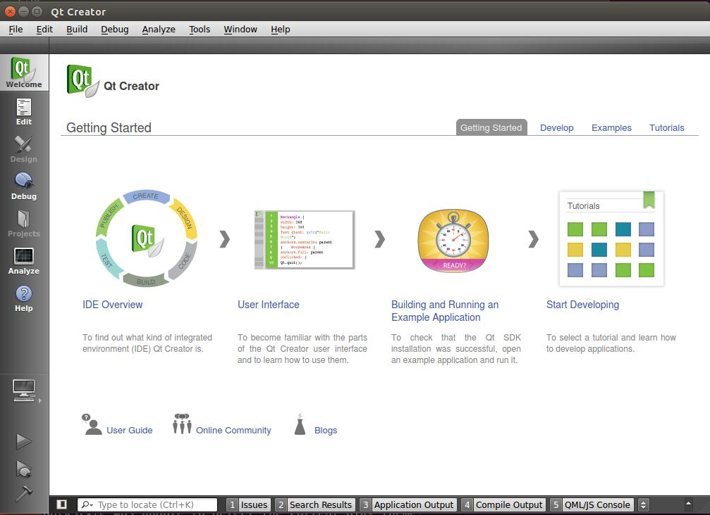
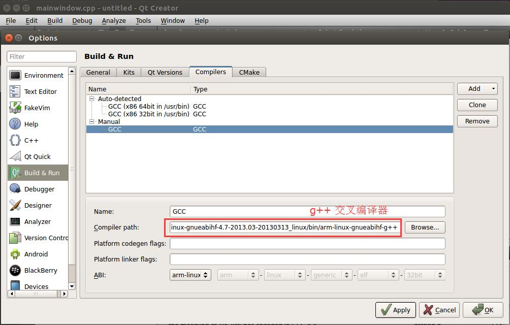
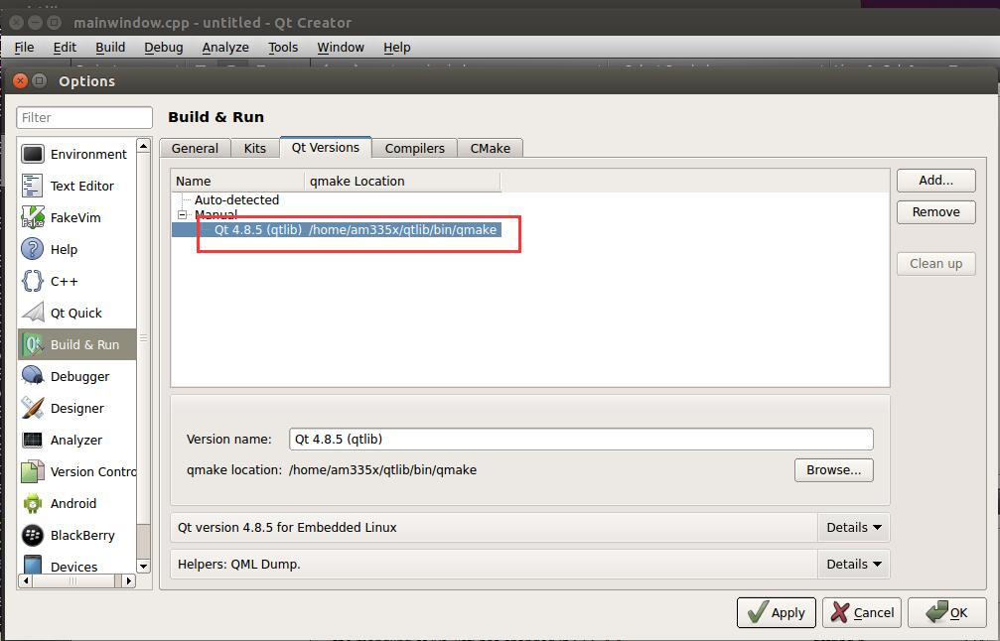
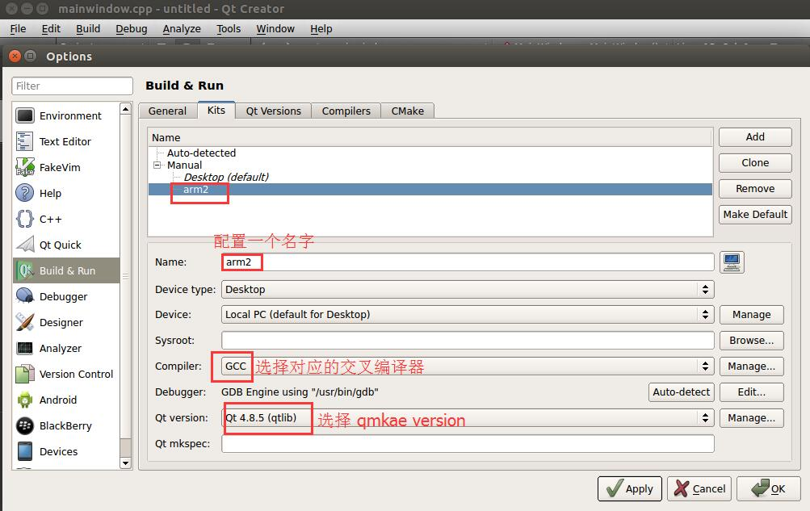

# Qt4.8.5 交叉编译说明

## 一、相关源码下载：
* tslib 源码下载地址 : [tslib](https://github.com/kergoth/tslib/releases/download/1.5/tslib-1.5.tar.xz)
* Qt4.8.5 源码下载地址： [Qt4.8.6](http://download.qt.io/archive/qt/4.8/4.8.5/qt-everywhere-opensource-src-4.8.5.tar.gz)

## 二、 tslib 的移植
* 解压 tslib.
* 进入 tslib 源代码目录
* 修改 autogen.sh
```sh
  #!/bin/sh

  echo "ac_cv_func_malloc_0_nonnull=yes" >daiq_tslib.cache
  autoreconf -f -i -I $(pwd)/m4
  exit $?
```
* 运行 autogen.sh
```sh
  ./autogen.sh
```
* 写一个配置的脚本
* mygen.sh
```sh
  #!/bin/sh
  ./configure \
    --prefix=/home/am335x/test/tslib/out \
    --host=arm-linux-gnueabihf
```
* 给这个配置脚本加一个权限
```sh
  chmod +x mygen.sh
```
* 运行这个脚本
```sh
  ./mygen.sh
```
* 编译
```sh
  make && make install
```
* 生成的库在 out 文件夹下面
```sh
  am335x@am335x:~/test/tslib$ ls out/
  bin  etc  include  lib  share
  am335x@am335x:~/test/tslib$
```

## 三、Qt 交叉编译
* 将 Qt 源码放入 Ubuntu 虚拟机，并解压。
```sh
  tar -xvf qt-everywhere-opensource-src-4.8.5.tar.gz
  cd qt-everywhere-opensource-src-4.8.5/
```
* 复制一份配置文件
```sh
  cp mkspecs/qws/linux-arm-gnueabi-g++/  mkspecs/qws/linux-arm-gnueabihf-g++/ -rf
```
* 修改该配置文件 mkspecs/qws/linux-arm-gnueabihf-g++/qmake.conf
```c
  #
  # qmake configuration for building with arm-none-linux-gnueabi-g++
  #

  include(../../common/linux.conf)
  include(../../common/gcc-base-unix.conf)
  include(../../common/g++-unix.conf)
  include(../../common/qws.conf)

  # modifications to g++.conf
  QMAKE_CC                = arm-linux-gnueabihf-gcc  -lts
  QMAKE_CXX               = arm-linux-gnueabihf-g++  -lts
  QMAKE_LINK              = arm-linux-gnueabihf-g++  -lts
  QMAKE_LINK_SHLIB        = arm-linux-gnueabihf-g++  -lts

  # modifications to linux.conf
  QMAKE_AR                = arm-linux-gnueabihf-ar cqs
  QMAKE_OBJCOPY           = arm-linux-gnueabihf-objcopy
  QMAKE_STRIP             = arm-linux-gnueabihf-strip

  QMAKE_INCDIR            = /home/am335x/test/tslib/out/include
  QMAKE_LIBDIR            = /home/am335x/test/tslib/out/lib
  # 上面这两条是 tslib 库的位置

  load(qt_config)
```
*  在 mkspecs/common/linux.conf 这一行加入 -lts
```c
  QMAKE_LIBS_THREAD     = -lpthread -lts
```
* 家目录创建一个 qtlib 目录
```sh
  mkdir ~/qtlib
```
* 在 Qt4.8.5 源码目录创建 config.sh 配置脚本
```sh
  #!/bin/sh

  ./configure \
    -opensource \
    -prefix  /home/am335x/qtlib   \
    -confirm-license \
    -release \
    -shared \
    -embedded arm \
    -force-pkg-config \
    -xplatform qws/linux-arm-gnueabihf-g++ \
    -depths 16,18,24,32 \
    -fast \
    -optimized-qmake \
    -pch \
    -qt-sql-sqlite \
    -qt-libjpeg \
    -qt-zlib \
    -qt-libpng \
    -qt-freetype \
    -little-endian -host-little-endian \
    -no-qt3support \
    -qt-libtiff -qt-libmng \
    -make translations \
    -qt-gfx-linuxfb -qt-gfx-transformed -qt-gfx-multiscreen \
    -no-gfx-vnc -no-gfx-qvfb -qt-kbd-linuxinput \
    -no-kbd-qvfb -armfpa  \
    -no-mouse-qvfb \
    -no-opengl \
    -no-mmx -no-sse -no-sse2 \
    -no-3dnow \
    -no-openssl \
    -webkit \
    -no-qvfb \
    -no-phonon \
    -no-nis \
    -no-opengl \
    -no-cups \
    -no-glib \
    -no-xcursor -no-xfixes -no-xrandr -no-xrender \
    -no-separate-debug-info \
    -nomake examples -make tools -nomake docs \
    -qt-mouse-tslib -DQT_QLOCALE_USES_FCVT \
    -I/home/am335x/test/tslib/out/include \
    -L/home/am335x/test/tslib/out/lib \
    -no-pch
```
* 给它加一个执行权限,并执行
```sh
  chmod +x config.sh && ./config.sh
```
* 执行编译并安装
```sh
  make -j4 && make install
```
```sh
  am335x@am335x:~/qtlib$ ls ~/qtlib/
  bin  imports  include  lib  mkspecs  phrasebooks  plugins  q3porting.xml  tests  translations
```

## 四、 Qtcreator 安装及环境配置
* Qtcreator 下载地址： [Qtcreator](https://download.qt.io/official_releases/qtcreator/2.8/2.8.1/qt-creator-linux-x86_64-opensource-2.8.1.run)
* 下载完之后，将这个文件放到 Ubuntu 虚拟机里面，加一个执行权限，并运行。
```sh
  chmod +x qt-creator-linux-x86_64-opensource-2.8.1.run && ./qt-creator-linux-x86_64-opensource-2.8.1.run
```
*  安装完毕打开 qtcreator
  

*  配置交叉编译器
  * 进入 Tools->Options
  

* 配置 qmake。
  * 进入 Tools->Options
  

* 配置 qkit
  * 进入 Tools->Options
  

* 配置完毕，选择 Apply, OK
* 打开一个例程，进行编译，KIt Selection 的时候要选择 arm2
