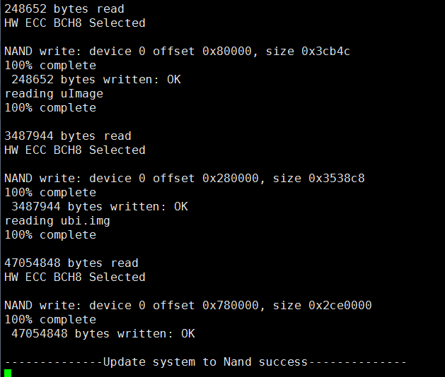
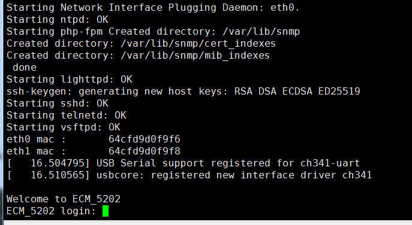
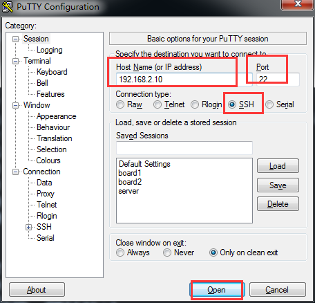
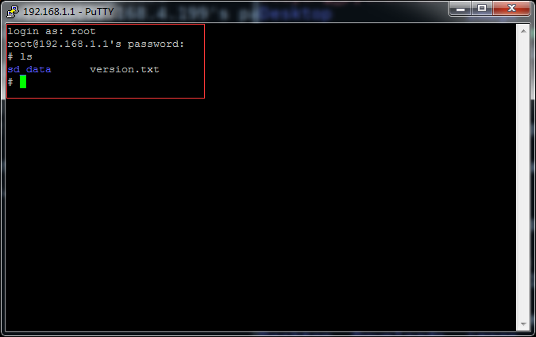
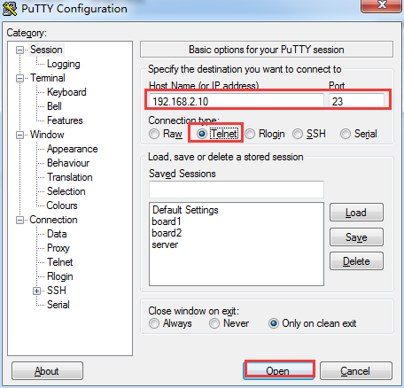
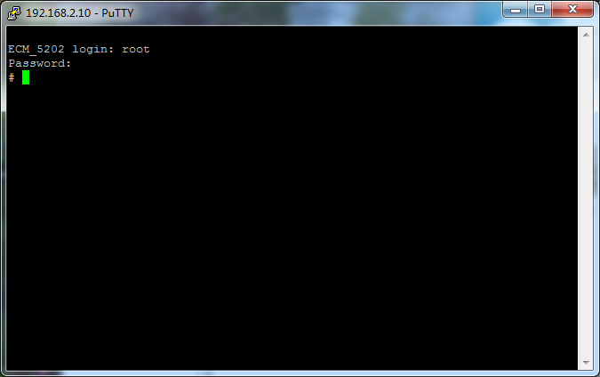
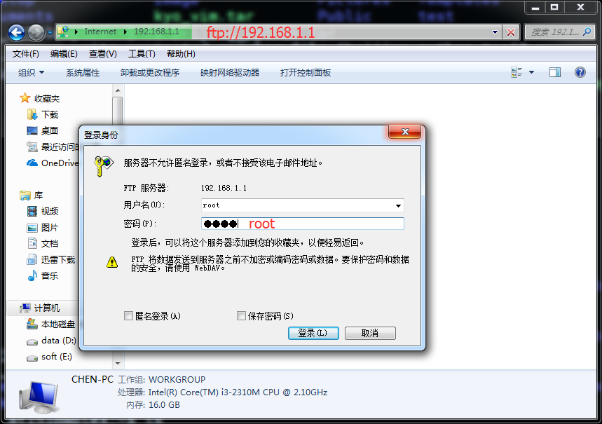

# ECM_5206 快速启动文档
* 请参考[CrossCompiler](CrossCompiler.md)进行镜像编译。
* 请参考[MkSDimg](MkSDimg.md) 制作 SD 。

## 一、软件的烧写
* debug 原理图如下：
  
* 此处为 RS-232 信号。
* 设置 波特率 115200， 数据位 8， 检验位 none, 停止位 1.
* 烧录软件时，先将 ECM_5206 的 SW1 1 拨到 OFF
* 插入 SD 卡，上电。
* 当 debug 出现如下信息时候，表示烧录系统完毕。
   

## 二、系统启动
* SW 拨到 ON。
* 重新上电。
* debug 有如下信息提示:
  
* 登录用户： root
* 登录密码： root

## 三、使用 Telnet, ssh 登录 ECM_5206
* 通过网线接入 ETH0 网口。
* SSH 登录如下：
  * 登录 IP : `192.168.2.10`
  * 账号 : `root`  密码：`root`
  
  
* Telnet 登录如下：
  * 登录 IP : `192.168.2.10`
  * 账号 : `root`  密码：`root`
  
  
* Vsftp 登录如下:
  * 直接打开 Windows 的文件浏览器，在地址栏输入 ftp://192.168.2.10
  * 用户: `root`   密码： `root`
  
  * 可以直接传输文件。
