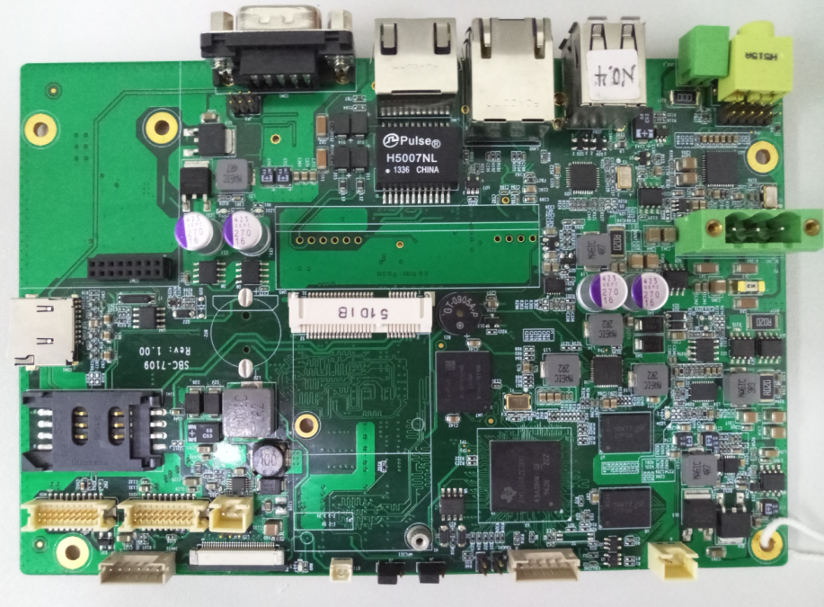
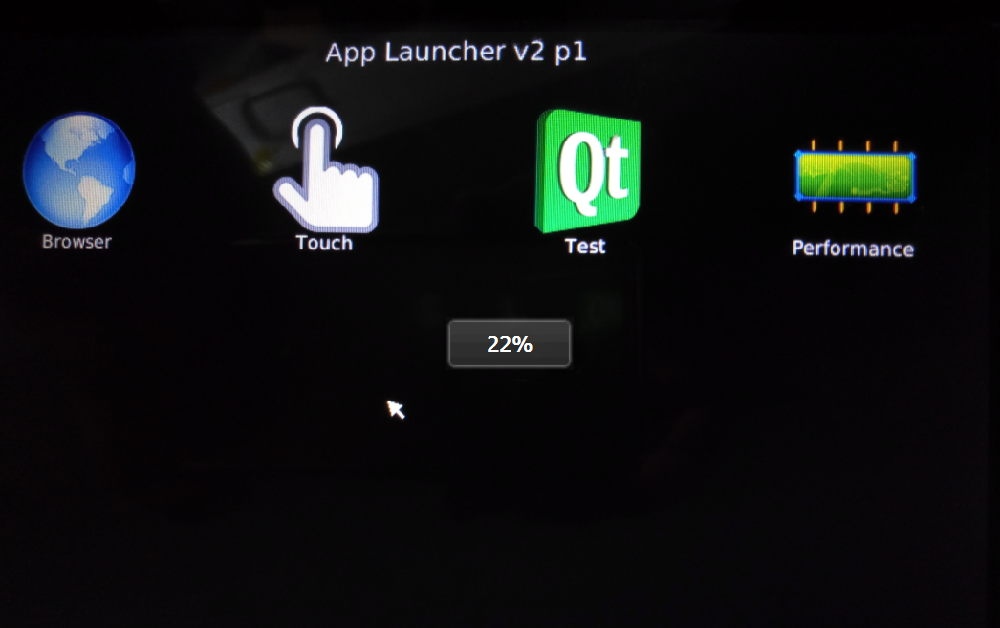

# SBC-7109S-Linux4.4.12-Qt4.8.5 Quick Start Guide

## 一、说明

如果您还没有硬件主板或者对应的开发BSP包，请跟我们的业务人员联系，他们将会向您提供相关硬件、软件资源。

## 二、主板硬件信息

* 9-24V电源输入；
* 2路USB 2.0 A接口；
* 2路10/100M网口；
* 1路RS232/RS485/RS422接口；
* 1路microSD（TF）卡接口；
* 1路LVDS接口：
* 1路LCD接口
* 1路Audio

## 三、主板软件桌面

* Browser：浏览器；
* Touch：触摸屏矫正软件；
* Test：主板硬件测试软件；
* Performance：性能测试软件；
* SD卡烧入系统的时候桌面另外包含一个BurnSystem 软件；

## 四、烧录系统

**以下操作均是以您从业务人员获取到的BSP包的目录为根目录进行操作，PC机操作系统环境是Ubuntu12.04。**

### 4.1 烧录系统步骤

* 4.1.1 制作SD卡启动系统
	* 将BSP包中的 linux-devkit/tools/mksd.sh 放到你的Ubuntu 系统中。
	* 插入你的SD卡并在普通用户下运行该脚本，带一个SD卡块设备节点，如/dev/sdb
	* 步骤如下：
		* ./mksd.sh  /deb/sdb          
		* 输入你的root密码
		* 等待所有操作执行完毕，提示 ： make sd card partition over ....
	* 重新拔出SD卡并再次插入，等待系统检测到SD卡的两个分区。
	* 将 board-support/prebuilt-images 文件夹内的所有文件拷入SD卡boot分区。
	* 将 filesystem 文件夹内的rootfs.tar 解压到SD卡的rootfs分区。		
		* 并在最后运行如下两条命令：
		* sync
		* 在 `ubuntu 12.04`中使用`sudo umount /media/*`卸载SD卡。 
		* 在 `Ubuntu 14.04`以及更高的版本中使用`sudo umount /media/$(whoami)/*`卸载SD卡。		
		* 拔出SD卡；
* 4.1.2 启动SD卡系统后烧到系统到emmc
	* 将SD卡插入主板SD卡槽，上电启动。
	* 点击桌面的BurnSystem 软件，在点击Start 按钮。
	* 根据最后显示的提示：Burn the new system over... , 然后关闭软件，关闭电源，拔出SD卡。
	* 重新上电，即可启动emmc 系统。

## 五、版权说明

以上所有内容最终解释权归[aplex](http://www.aplextec.com/cn/home.php)公司所有。
