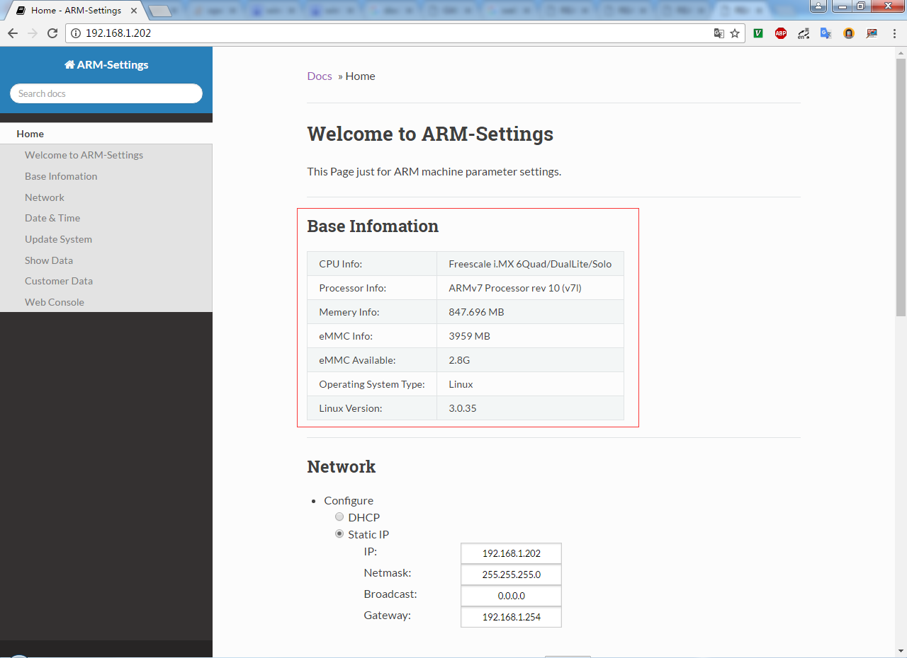
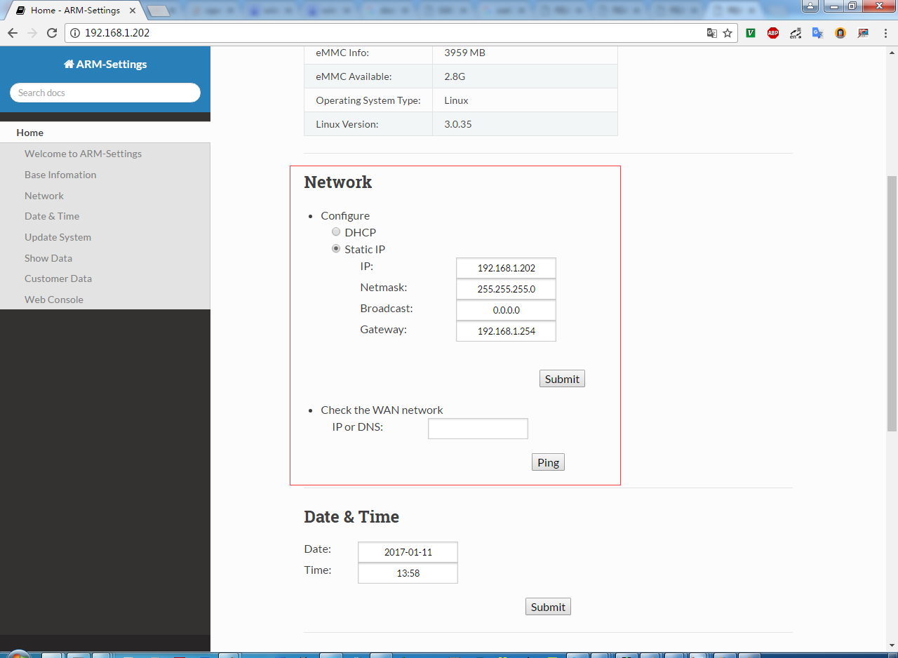
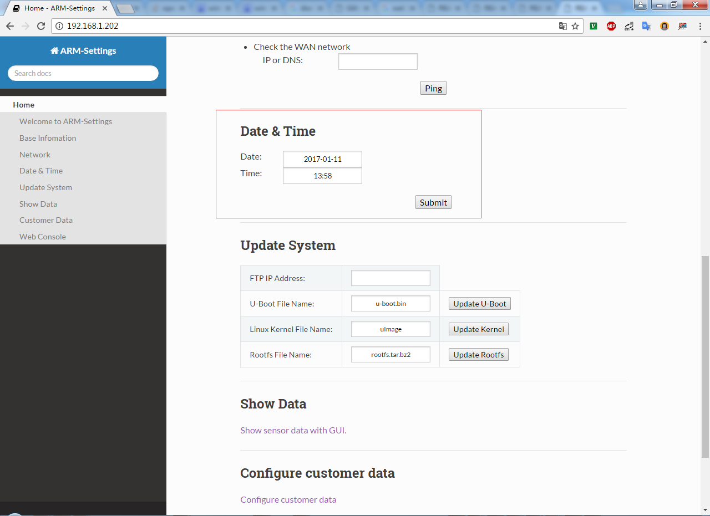
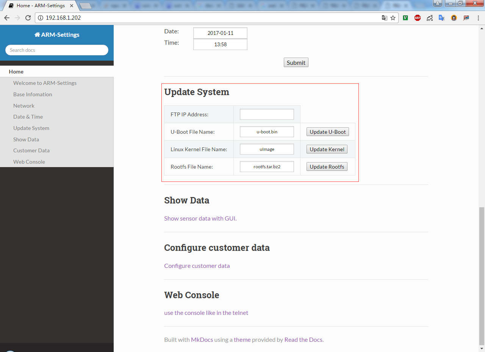
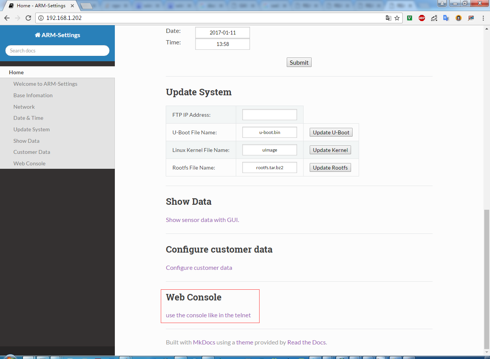
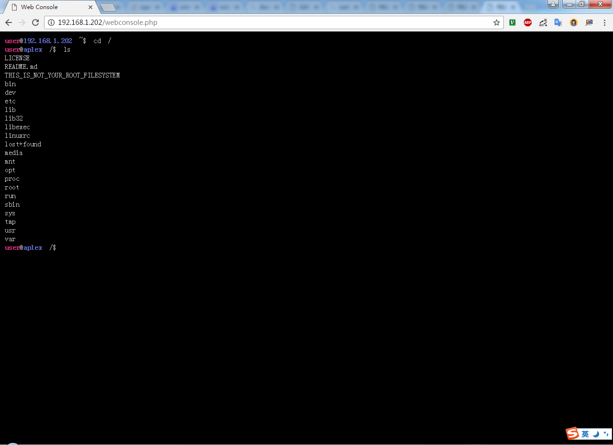

# ARM-Settings Quick Start Guide

* 强烈建议使用Chrome，版本越新越好；
* 在浏览器中输入您的设备的IP，即可看到如下所述内容：

## 一、基本信息

主要用于显示主板上的一些基本信息：  

## 二、网络配置

默认会显示当前主板系统IP的方式，提供ping功能，用于网络畅通测试：  

## 三、日期&时间

用于重新配置系统日期&时间：  

## 四、系统更新

通过指定FTP服务端的IP，自动从FTP服务器获取相关文件，并更新系统对应内容，如何在Windows下配置FTP Server，请参考：[《Windows FTP Server》](https://github.com/AplexOS/zh-cmn-Hans/tree/FTP-Server_Windows_SDK)  

## 五、用户数据

这部分是单独对用户软件数据设置进行制作的页面：  

## 六、web Console

主要提供一个Web形式的命令行终端，目前不支持Vi/Vim、ping等需要持续输入的命令行命令：  

## 七、版权说明

以上所有内容最终解释权归[aplex](http://www.aplextec.com/cn/home.php)公司所有。
