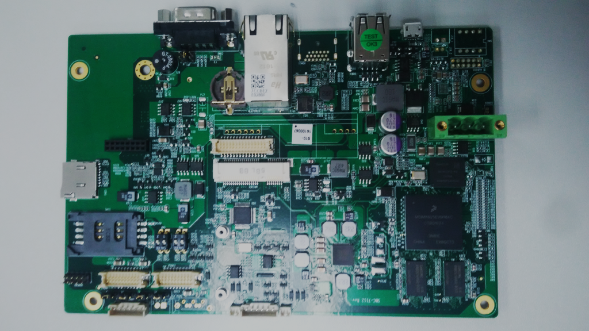
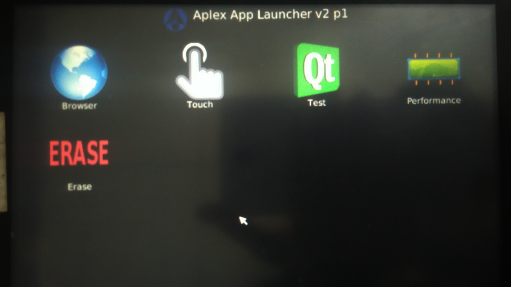
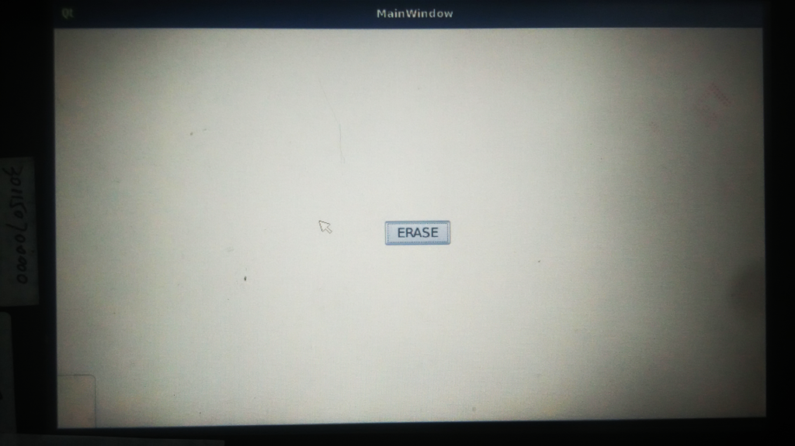
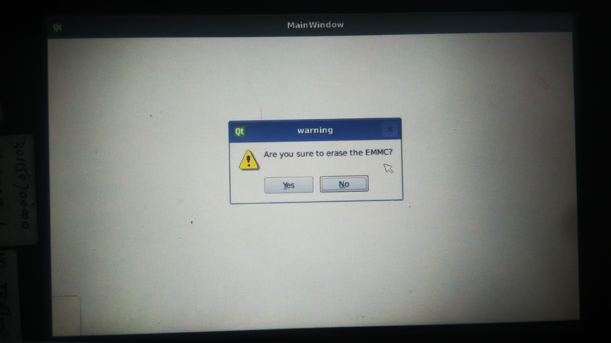
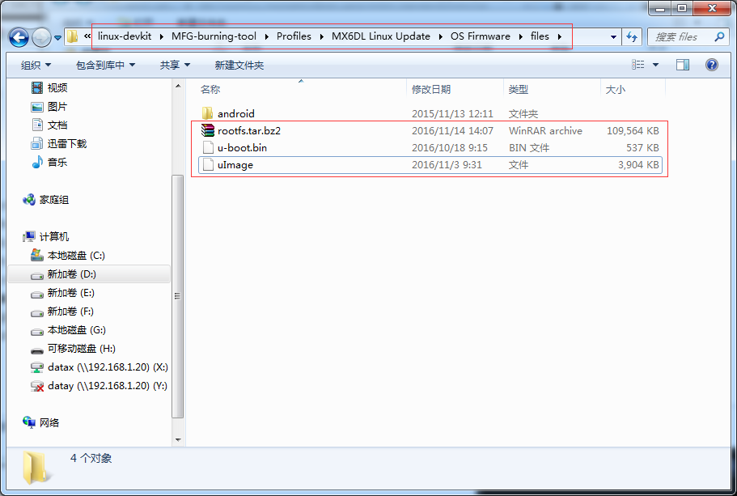
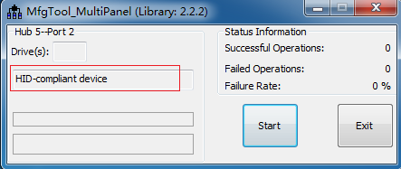
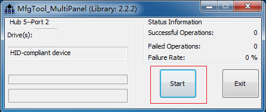
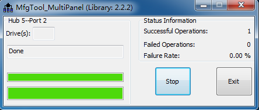

# Quick Start Guide

## 一、说明

如果你还没有硬件主板或者对应的开发BSP包，请跟我们的业务人员联系，他们将会向您提供相关硬件、软件资源。

## 二、主板硬件信息

* 9-24V电源输入；
* 2路USB 2.0 A接口；
* 1路10/100/1000M网口；
* 1路RS232/RS485/RS422接口；
* 1路microSD（TF）卡接口；
* 2路LVDS接口：

## 三、主板软件桌面

* Browser：浏览器；
* Touch：触摸屏矫正软件；
* Test：主板硬件测试软件；
* Performance：性能测试软件；
* Erase：系统重新烧录工具。

## 四、擦除并烧录系统

* **以下操作均是以您从业务人员获取到的BSP包的目录为根目录进行操作，PC机操作系统环境是Windows 7。**
* 如果你的主板并未烧录系统，可以跳过擦除系统阶段。

### 4.1 擦除系统步骤

* 点击主板软件桌面上的ERASE软件，进入如下软件界面：
 
* 点击ERASE按钮进行擦除，进入如下软件界面：
 
* 点击Yes按钮进行确认，进入如下软件界面：
 
* 操作将在1s内完成，您只需要等待1s钟，之后请对主板断电。

### 4.2 烧录系统步骤

* `linux-devkit/MFG-burning-tool`目录是系统烧录工具，将`board-support/prebuild-images`目录下的`u-boot.bin`、`uImage`、`rootfs.tar.bz2`放入`linux-devkit/MFG-burning-tool/Profiles/MX6DL Linux Update/OS Firmware/files`目录下，如图：  
 
* 双击执行`linux-devkit/MFG-burning-tool/MfgTool2.exe`应用程序，出现如下界面则表示检测到主板CPU：  
 
* 点击Start按钮进行烧写：  
 
* 当出现如下界面则表示烧写成功，点击Stop然后点击Exit退出程序：  
 
* 对主板断电，并重新上电，确认系统运行状态。
