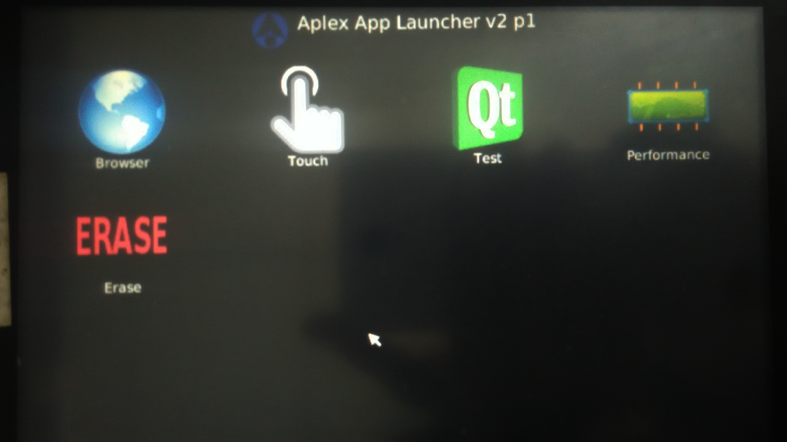
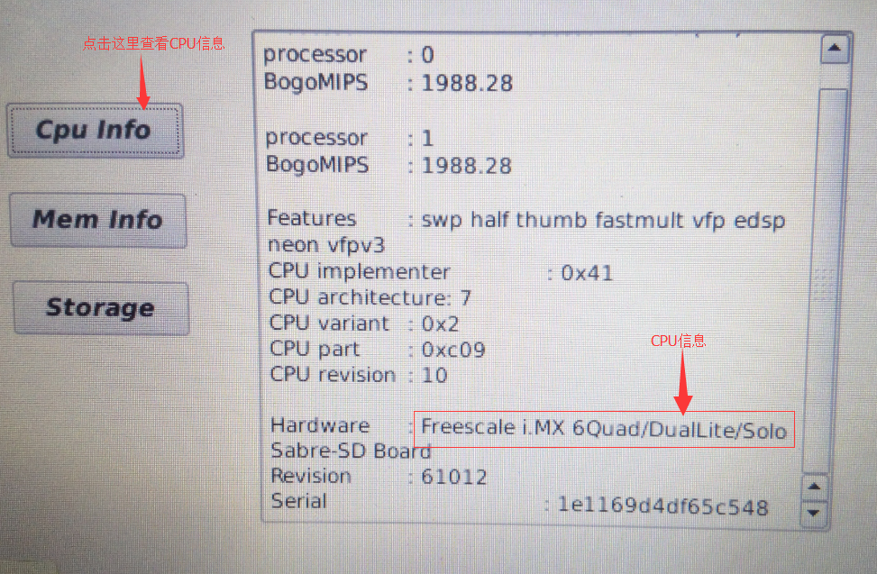
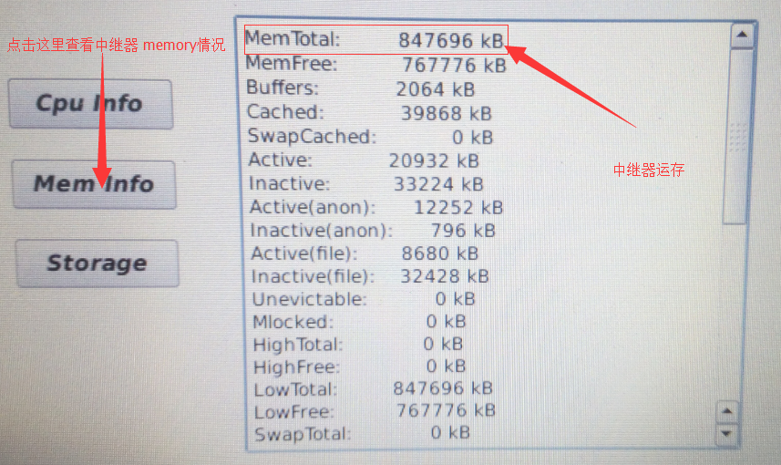
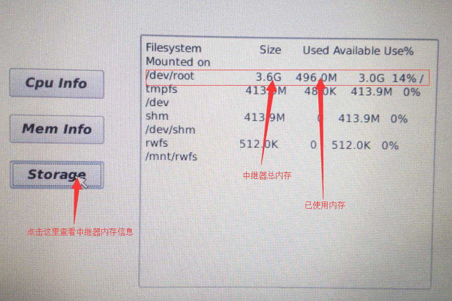

# Relay Terminal SOP

## 一、主板接口

## 二、Switch扩展板

## 三、OTG系统烧录
* 工具：PC机一台、USB OTG线一条、中继器一台、24V电源一套、烧录软件；
* 步骤：
  * 下载烧录工具：[MfgTool](https://github.com/ZengjfOS/MfgToolA51)
  * [MfgTool](https://github.com/ZengjfOS/MfgToolA51)工具使用请参考的README的[《1.4 Linux3.0.35-eMMC-MX6DL-ALL.vbs》](https://github.com/ZengjfOS/MfgToolA51#14-linux3035-emmc-mx6dl-allvbs)小节；
  * `prebuild`目录中提供已经编译、测试OK的系统，可直接用于烧录、测试；
  * 将核心板（面板）`SW1`拨码开关2号拨码拨到OFF一侧(ON的对侧)，并通过MICRO USB线连接好主板上`USB1`和PC机上的USB接口，按中继器供电要求给中继器供电。
  * 双击执行`Linux3.0.35-eMMC-MX6DL-ALL.vbs`应用程序，出现如下图界面则表示：  
    
  * 点击`start`按钮进行烧写，当出现如下图界面则表示烧写成功，点击`stop`然后点击`exit`退出程序：  
    
  * 关闭核心板电源，将`SW1`第2位拨码开关拨到`ON`一侧，开启电源即可开始运行系统。

## 四、桌面系统

桌面大致类似如下图，具体桌面图标视实际烧录之后的系统而定：

## 五、查看系统信息
* 按中继器供电要求给中继器电(输入电压为24V，下同)。
* 打开桌面上的`Information`点击`Cpu info`可查看CPU信息；可看见`Hardware：`后面显示为`Freecale I.MX 6Quad/DualLite/SoloSabre-SD Board`，如图：
  
* 点击`Mem Info`可查看Memory信息，显示`Mem Total：847696 KB`即OK。
  
* 点击`Storage`可查看Storage信息，显示`/dev/root 3.6G`即OK。
  

## 六、测试

### 6.1 GPIO测试

### 6.2 UART测试

### 6.3 Buzzer测试

### 6.4 USB设备测试

### 6.5 网络测试

### 6.6 SD卡测试

### 6.7 RTC测试

### 6.8 开关机测试

### 6.9 Touch测试

### 6.10 CPU测试
