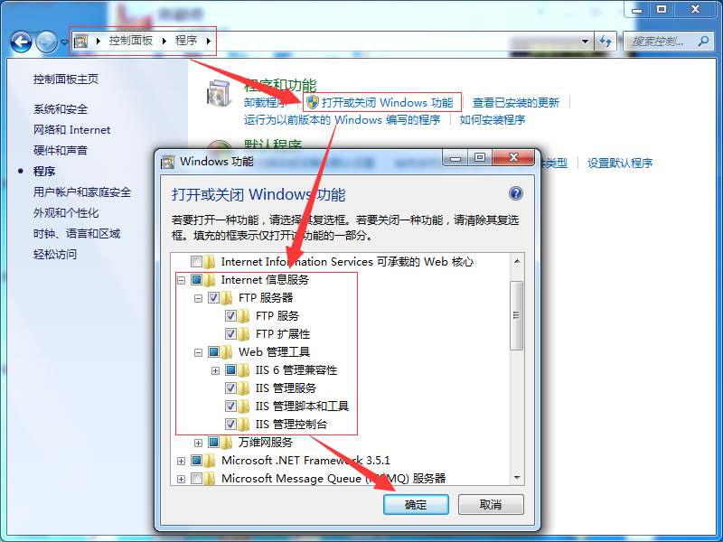
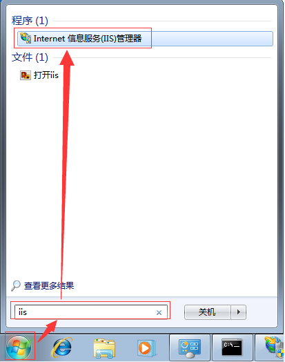
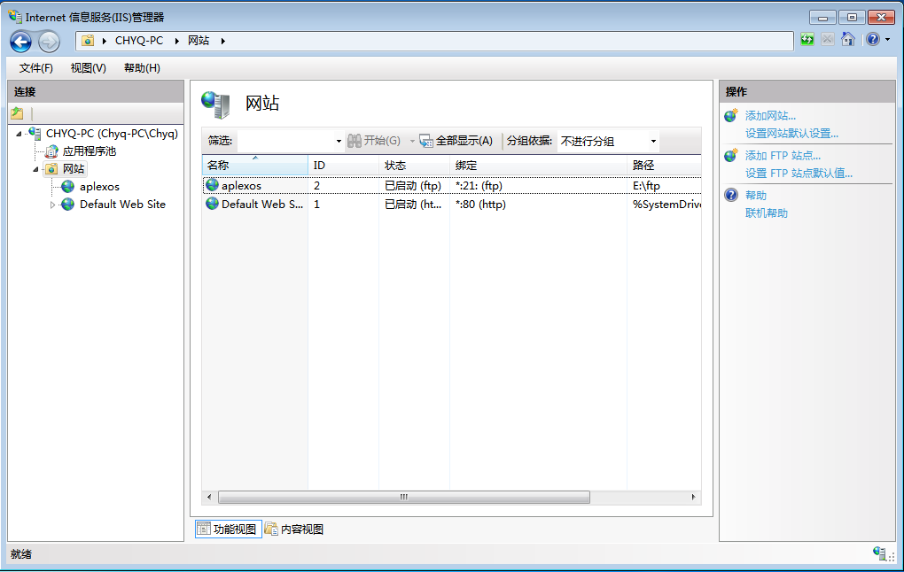
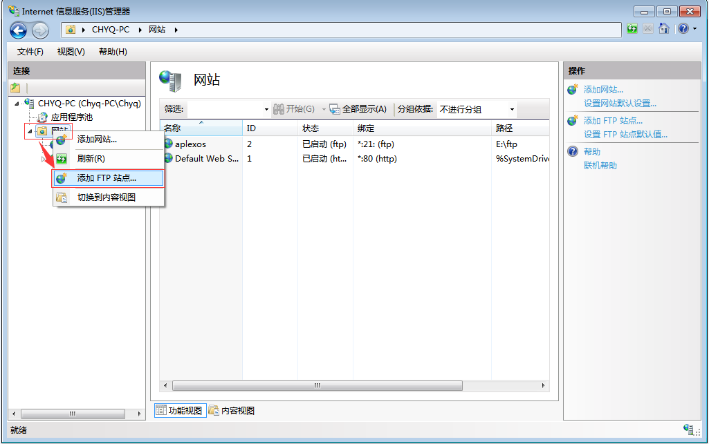
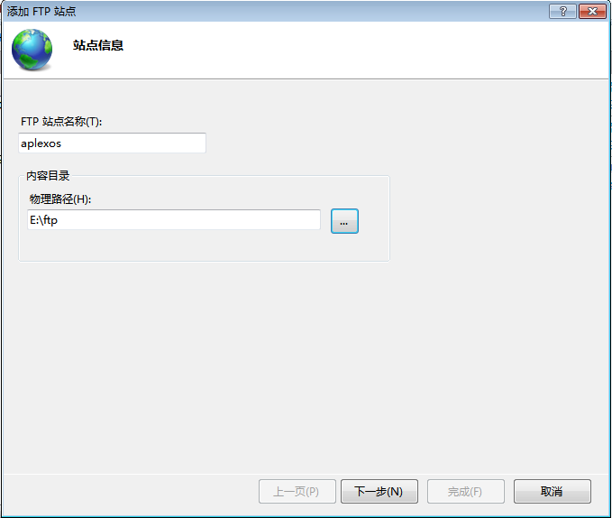
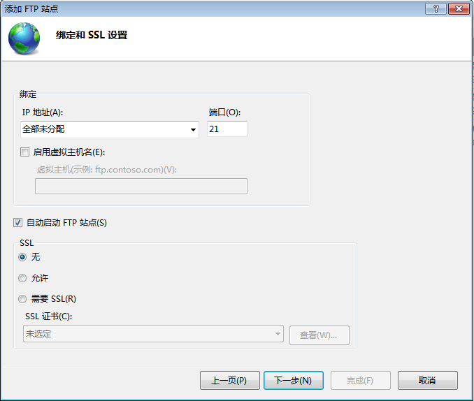
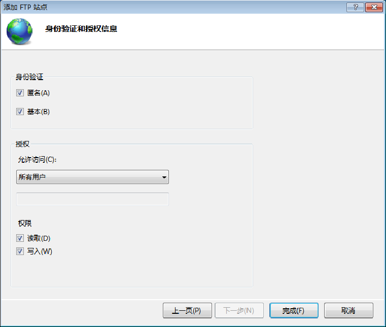
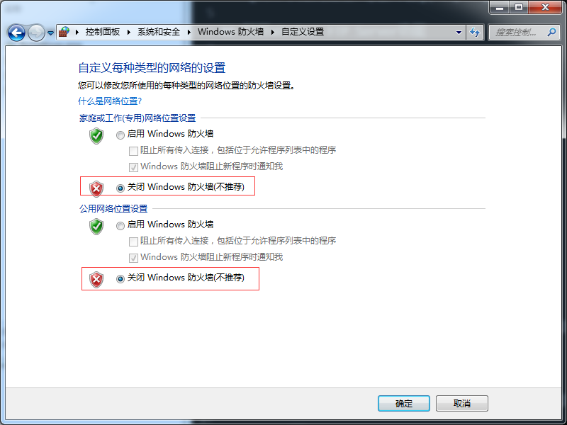
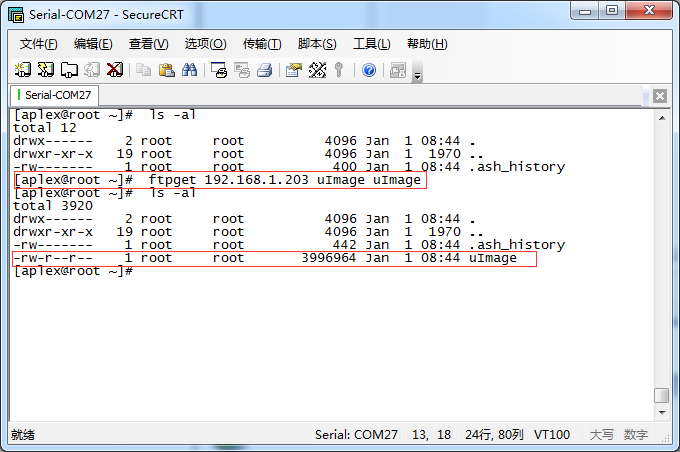

# Windows FTP Server

## 一、参考文档

在看文本之前，请先阅读一下这篇文档：[win7下如何建立ftp服务器](http://jingyan.baidu.com/article/574c5219d466c36c8d9dc138.html)

## 二、打开Windows FTP Server功能

## 三、IIS FTP配置

* 3.1 打开IIS  

* 3.2 IIS界面  

* 3.3 创建FTP Server  

* 3.4 配置站点信息  

* 3.5 FTP SSL配置  

* 3.6 FTP访问配置  

* 3.7 关闭防火墙  

* 3.8 ARM主板上ftpget测试

