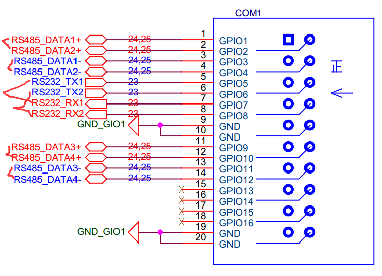
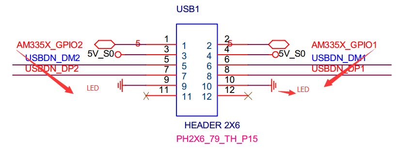
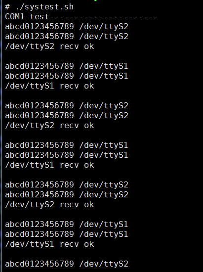
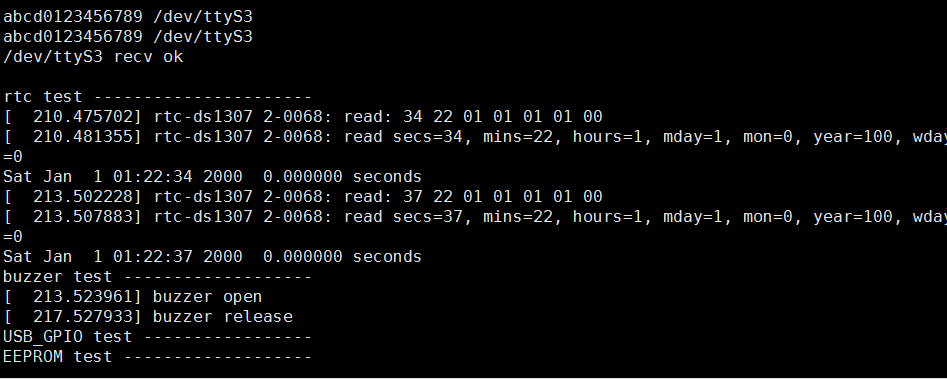
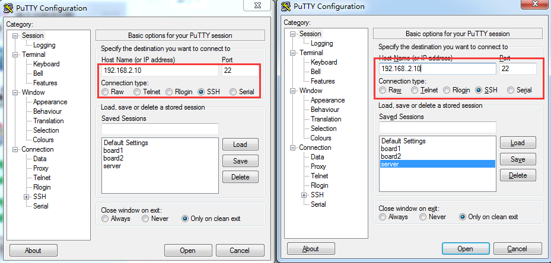
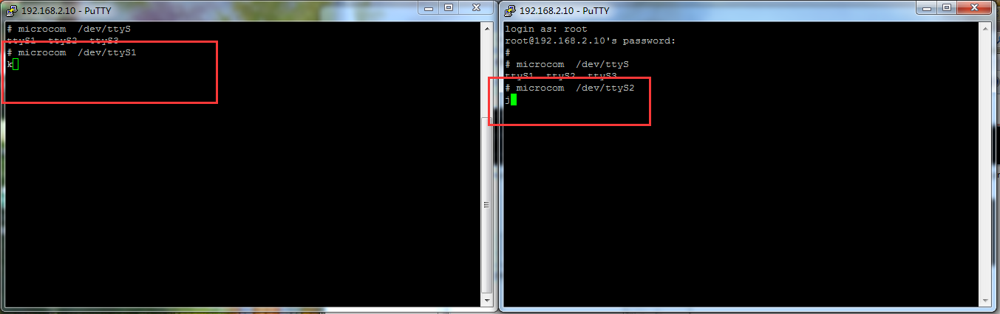

# CMI_AT752 测试说明

## 一、硬件接线方式
* COM1 的 DATA1+ 接 DATA2+
* COM1 的 DATA1- 接 DATA1-
  
* USB1 接口上 RS232_TXD5 与 RXD5 对接
* AM335X_GPIO6 AM335X_GPIO7 各接一个灯
  

## 二、测试命令
* 登录后，输入 `./systest.sh`
  
  
* ttyS1 ttyS2 是 COM1 上的 RS-485 设备节点
* ttyS1 是 RS485-DATA1+ RS485-DATA1-
* ttyS2 是 RS485-DATA2+ RS485-DATA2-
* ttyS3 是 USB1 上面的 RS-232 设备节点
* RTC 要看两次时间是否差3秒
* eeprom 看是否显示
* 看 LED 是否显示两次
* 听 BUZZER 是否有响声

## 三、单独测试方法
* 串口测试方法
  * 串口测试方法, 假设测试 ttyS1 , ttyS2
  * 先按照上面的方法，将两个串口对接.
  * 使用 ssh 登录进入，登录两个 SSH， 开两个窗口。
  * 两个窗口，分别执行命令
  * `microcom /dev/ttyS1`
  * `microcom /dev/ttyS2`
  * 操作如下图所示 :
    
    
  * 退出为 ctrl + x
  * USB1 上面的设备节点是 RS-232
  * RS-232可以自发自收测试。
  * microcom /dev/ttyS3
  * 按键盘，看有没有数据返回
* USB 测试方法
  * 插入 U 盘
  * 执行如下命令
  * `ls /dev/sd*`
  * 看有没有出现设备节点
* BUZZER 测试
  * 执行如下命令
  * `test_buzzer`
  * 看 BUZZER 会不会响
* RTC 测试
  * 执行如下命令
  * `hwclock -r`
  * 看有没有时间显示
* EEPROM 测试
  * 执行如下命令
  * echo 12345 > /dev/eeprom
  * cat /dev/eeprom
  * 看 会不会有 数字， 而且有一堆乱码，一般情况下
* USB1 上面的 GPIO6 GPIO7 测试
  * 执行如下命令
  * `echo 0 > /dev/GPIO6`
  * `echo 0 > /dev/GPIO7`  
  * `echo 1 > /dev/GPIO6`
  * `echo 1 > /dev/GPIO7`
  * 看 GPIO6 GPIO7 电平是否发生了变化。
* 网口测试
  * 看是否能接上 SSH, Telnet, Vsftpd
