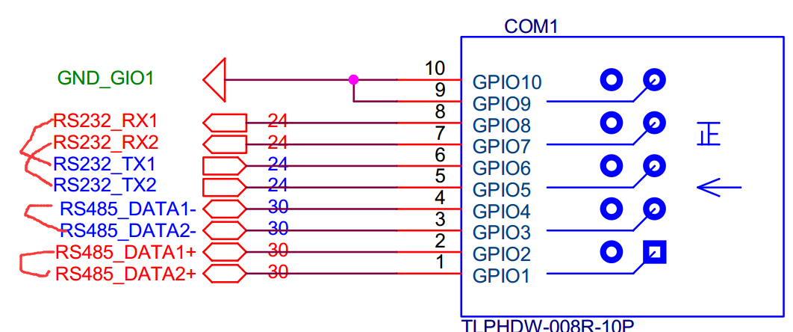
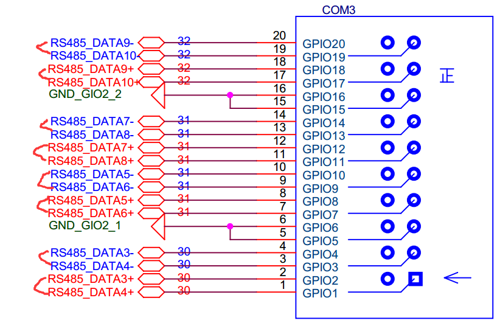

# ECM_5206 测试说明

## 一、硬件接线方式
* COM1 的 DATA1+ 接 DATA2+
* COM1 的 DATA1- 接 DATA2-
* COM1 的 DATA3+ 接 DATA4+
* COM1 的 DATA3- 接 DATA4-
* COM1 的 RS232_TX1 与 RS232_RX1 对接
* 以此类推
  
  
* COM4 进行 DI DO 的对测
  
* J3 的 USB 外接 U 盘进行测试
* J3 上 4 个 GPIO 都与地相对接。

## 二、单独测试方法
* 串口测试方法
  * 串口测试方法, 假设测试 ttyS1 , ttyS2
  * 先按照上面的方法，将两个串口对接.
  * 使用 ssh 登录进入，登录两个 SSH， 开两个窗口。
  * 两个窗口，分别执行命令
  * `microcom /dev/ttyS1`
  * `microcom /dev/ttyS2`
  * 操作如下图所示 :
    
    
  * 退出为 ctrl + x
  * 后面的测试如上
  * RS-232可以自发自收测试。
  * microcom /dev/ttyS1
  * 按键盘，看有没有数据返回
* USB 测试方法
  * 插入 U 盘
  * 执行如下命令
  * `ls /dev/sd*`
  * 看有没有出现设备节点
* RTC 测试
  * 执行如下命令
  * `hwclock -r`
  * 看有没有时间显示
* EEPROM 测试
  * 执行如下命令
  * echo 12345 > /dev/eeprom
  * cat /dev/eeprom
  * 看 会不会有 数字， 而且有一堆乱码，一般情况下
* USB1 上面的 AM335X_GPIO1 AM335X_GPIO2 ..  测试
  * 执行如下命令
  * `echo 0 > /dev/GPIO0 `
  * `echo 0 > /dev/GPIO1 `
  * `echo 0 > /dev/GPIO2 `
  * `echo 0 > /dev/GPIO3 `
  * `echo 1 > /dev/GPIO0 `
  * `echo 1 > /dev/GPIO1 `
  * `echo 1 > /dev/GPIO2 `
  * `echo 1 > /dev/GPIO3 `
  * 看 这四个 GPIO 的电平是否发生了变化。
* DI DO 测试
  * 执行如下命令
  * `echo 0 > /dev/DO0`
  * `echo 0 > /dev/DO1`
  * `echo 0 > /dev/DO2`
  * `echo 0 > /dev/DO3`  
  * `echo 1 > /dev/DO0`
  * `echo 1 > /dev/DO1`
  * `echo 1 > /dev/DO2`
  * `echo 1 > /dev/DO3`
* 网口测试
  * 看是否能接上 SSH, Telnet, Vsftpd
  * 配置网口 IP 的方法为 `ifconfig`
  * 比如说，配置 网口 2 的IP
  * `ifconfig eth1 192.168.4.200`
* Watchdog 测试方法
  * 执行如下命令：
  * `echo 0 > /dev/watchdog`
  * 60S 后 会重启，表示看门狗OK。
* 热机程序测试
  * 执行如下命令
  * `/root/testcpu.sh start`
  * 执行 `top` 命令，可以看到 CPU 占用率。
  * `/root/testcpu.sh stop`
  * 结束命令
* 开关机测试
  * 开始
  * `/root/on-off.sh start`
  * 结束
  * `/root/on-off.sh end`
* ntp
  * 使用 `ntpdate -h` 查看使用已经安装该程序
* Vsftpd
  * 使用 ftp 登录验证
* Telnetd
  * 使用 Telnet 登录测试
* SSH
  * SSH 登录测试
* httpd
  * 在 Chrome 输入 192.168.2.10 进行测试
* snmpd
  * `snmpd -help`
* openvpn
  * `openvpn`
* vi
  *  `vi test.txt`
  * `:wp`
* 序列号
  * `show_sn`
* 检查开机脚本是否存在
  * `ls /etc/init.d/S99rc`
* pppd
  * `pppd -h`
* ifplugd
  * `ifplugd -h`
* tcpdump
  * `tcpdump -help`
  * `ctrl + c` 退出
* iptables
  * `iptables -h`
* iproute2
  * `echo 200 John >>/etc/iproute2/rt_tables`
  * `ip rule add from 10.0.0.10 table John`
  * 看是否报错，如果没有，表示OK。
