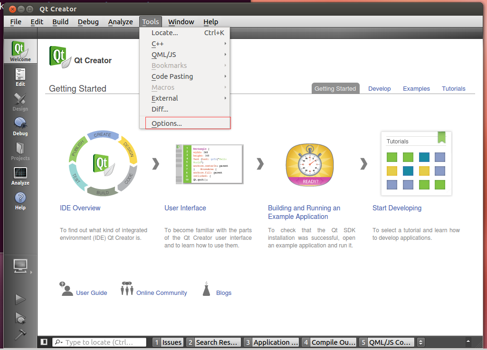
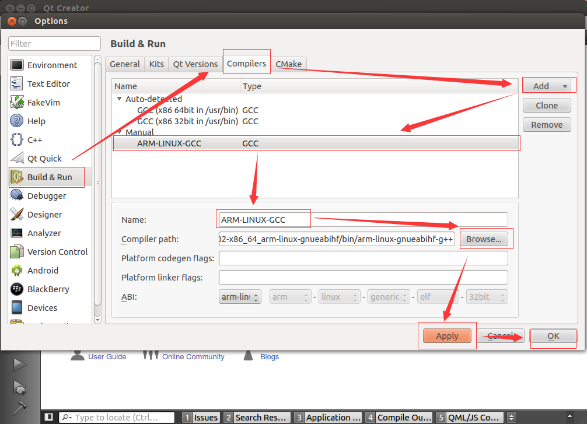
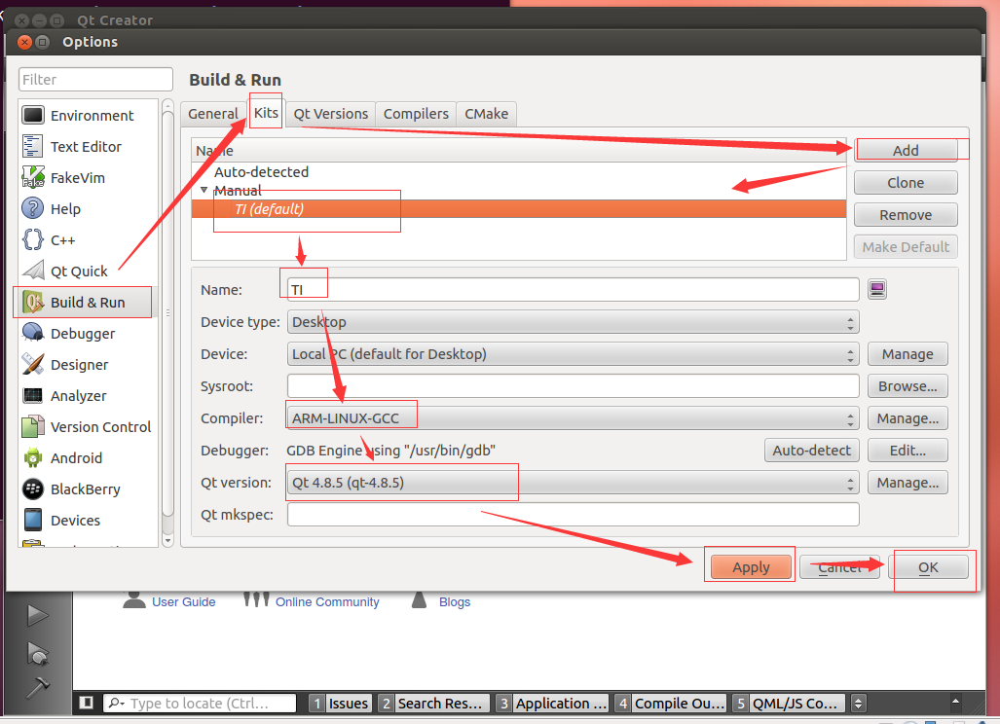

# SBC-7109S-Linux4.4.12-Qt4.8.5 User's Guide

## 一、说明

* 在阅读本文之前，请确保您已经阅读过[《SBC-7109S-Linux4.4.12-Qt4.8.5 Quick Start Guide》](Quick_Start_Guide.md)
* 如果您还没有硬件主板或者对应的开发BSP包，请跟我们的业务人员联系，他们将会向您提供相关硬件、软件资源。
* 本文涉及到的虚拟机操作，均以以下条件进行操作：
 * 采用VMware搭建的Ubuntu 12.04虚拟机；
 * 账户名：aplex；
 * 密码：aplex；
 * 以下执行的命令都是在VMware Ubuntu 12.04虚拟机中执行；
* 您作为本文档的阅读者，我们将假定您已经具备如下技能：
 * 熟悉并掌握Linux Shell命令；
 * 对Linux ARM交叉编译开发流程熟悉；
 * 对Qt Creator使用熟悉；

## 二、环境搭建、配置交叉编译器

* 使用VMware安装：Ubuntu 12.04 64位系统。  
如果您没有Ubuntu 12.04镜像，请使用BSP包中`board-support/VMware-Workstation/ubuntu-12.04-desktop-amd64.iso`镜像。
* 安装软件包，若果出现出错，请执行`sudo apt-get update`再继续：
```shell
    sudo apt-get update
	sudo apt-get install vim
    sudo apt-get install rpm 
    sudo apt-get install m4 
    sudo apt-get install bison 
    sudo apt-get install patch 
    sudo apt-get install build-essential 
    sudo apt-get install zlib1g 
    sudo apt-get install zlib1g-dev 
    sudo apt-get install ncurses-dev 
    sudo apt-get install texinfo 
    sudo apt-get install liblzo2-dev 
    sudo apt-get install uuid-dev 
    sudo apt-get install gettext 
    sudo apt-get install libglib2.0-dev
    sudo apt-get install tree
	sudo apt-get install appmenu-gtk:i386
    sudo apt-get install ia32-libs                  # 由于是64位系统的原因
    sudo apt-get install libc6-dev-i386             # 由于是64位系统的原因
    sudo apt-get install autoconf automake libtool  # 编译tslib时要用到
```
* 在aplex用户目录下创建aplex目录，所有所有操作内容均是在该目录下操作：
 * `cd ~`
 * `mkdir image`
 * `mkdir aplex`
 * `cd aplex`
* 创建编译器存放目录，并拷贝、解压编译器包，配置编译器路径：
 * `mkdir -p linux-devkit/compiler`
 * 将BSP包中`linux-devkit/compiler`中的编译器放入上面虚拟机`~/aplex/linux-devkit/compiler 当前目录下`的路径中,并解压：
```shell
	cd ~/aplex/linux-devkit/compiler
    tar -xvf gcc-linaro-5.3-2016.02-x86_64_arm-linux-gnueabihf.tar.xz
```

 * 配置交叉编译器路径：s
```shell
    aplex@Aplex:~/aplex$ cat ~/.bashrc
    [...省略前面无关内容]

	export PATH=/home/aplex/aplex/linux-devkit/compiler/gcc-linaro-5.3-2016.02-x86_64_arm-linux-gnueabihf/bin:$PATH
	export APLEX_PATH=~/image/
	
    aplex@Aplex:~$ 
```
* 测试交叉编译器是否正常：
```shell
    aplex@Aplex:~/aplex$ source ~/.bashrc 
    aplex@Aplex:~/aplex$ arm             # <---------- 这里按两次Tab键看效果
	arm2hpdl                        arm-linux-gnueabihf-gcov-tool
	arm-linux-gnueabihf-addr2line   arm-linux-gnueabihf-gdb
	arm-linux-gnueabihf-ar          arm-linux-gnueabihf-gfortran
	arm-linux-gnueabihf-as          arm-linux-gnueabihf-gprof
	arm-linux-gnueabihf-c++         arm-linux-gnueabihf-ld
	arm-linux-gnueabihf-c++filt     arm-linux-gnueabihf-ld.bfd
	arm-linux-gnueabihf-cpp         arm-linux-gnueabihf-nm
	arm-linux-gnueabihf-elfedit     arm-linux-gnueabihf-objcopy
	arm-linux-gnueabihf-g++         arm-linux-gnueabihf-objdump
	arm-linux-gnueabihf-gcc         arm-linux-gnueabihf-ranlib
	arm-linux-gnueabihf-gcc-5.3.1   arm-linux-gnueabihf-readelf
	arm-linux-gnueabihf-gcc-ar      arm-linux-gnueabihf-size
	arm-linux-gnueabihf-gcc-nm      arm-linux-gnueabihf-strings
	arm-linux-gnueabihf-gcc-ranlib  arm-linux-gnueabihf-strip
	arm-linux-gnueabihf-gcov        

    aplex@Aplex:~/aplex$ arm
```
* 文件夹结构如下：
```shell
    aplex@Aplex:~/aplex$ tree -L 3
    .
    └── linux-devkit
        └── compiler
            ├── gcc-linaro-5.3-2016.02-x86_64_arm-linux-gnueabihf
            └── gcc-linaro-5.3-2016.02-x86_64_arm-linux-gnueabihf.tar.xz

    3 directories, 1 file
    aplex@Aplex:~/aplex$ 
```

## 三、编译U-boot

* 虚拟机中创建`board-support/u-boot-source-code`和`linux-devkit/tools`目录：
```shell
	cd ~/aplex
	mkdir board-support/u-boot-source-code -p
	mkdir linux-devkit/tools -p
```
* 将BSP包中`board-support/u-boot-source-code`目录下的u-boot拷贝进虚拟机`board-support/u-boot-source-code`中，并解压tar包，操作如下：
```shell
	cd ~/aplex/board-support/u-boot-source-code/
	tar -xvf u-boot_2016.05.tar 	
```
* 将BSP包中的`linux-devkit/tools`目录下的`uboot_remake.sh`拷贝进虚拟机`linux-devkit/tools`中.

* 将uboot 目录加入环境变量
```shell
	aplex@aplex:~$ cat .bashrc 
	export UBOOT_PATH=/home/aplex/aplex/board-support/u-boot-source-code/u-boot_2016.05
```

* 编译U-Boot：
 * `cd ~/aplex/board-support/u-boot-source-code/u-boot_2016.05`
 * `make distclean`
 * `make clean`
 * `cd ~/aplex/linux-devkit/tools`
 * `./uboot_remake.sh`
 * 查看U-Boot目录编译后结果：
```shell
    aplex@aplex:~/aplex/board-support/u-boot-source-code/u-boot_2016.05$ ls out/
	arch    disk      include   net      System.map  u-boot.bin  u-boot.map
	board   drivers   lib       scripts  test        u-boot.cfg  u-boot-nodtb.bin
	cmd     examples  Makefile  source   tools       u-boot.img  u-boot.srec
	common  fs        MLO       spl      u-boot      u-boot.lds  u-boot.sym
	aplex@aplex:~/aplex/board-support/u-boot-source-code/u-boot_2016.05$ 
```

## 四、编译Linux Kernel

* 虚拟机中创建`board-support/linux-kernel-source-code`目录：
```shell
    aplex@aplex:~/aplex$ mkdir board-support/linux-kernel-source-code  -p
```
* 将BSP包中`board-support/linux-kernel-source-code`目录下的内核拷贝进虚拟机`board-support/linux-kernel-source-code`中，并解压tar包：
```shell
	aplex@aplex:~/aplex$ cd board-support/linux-kernel-source-code/
	aplex@aplex:~/aplex/board-support/linux-kernel-source-code$ ls
	kernel-4.4.12.tar
	aplex@aplex:~/aplex/board-support/linux-kernel-source-code$ tar -xvf kernel-4.4.12.tar 
	aplex@aplex:~/aplex/board-support/linux-kernel-source-code$ cd kernel-4.4.12/
	aplex@aplex:~/aplex/board-support/linux-kernel-source-code/kernel-4.4.12$ make distclean
```
* 将BSP包中`linux-devkit/tools`目录下的`kernel_remake.sh`拷贝进虚拟机的`linux-devkit/tools`.

* 将kernel 目录加入环境变量
```shell
	aplex@aplex:~$ cat .bashrc 
	export KERNEL_PATH=/home/aplex/aplex/board-support/linux-kernel-source-code/
```

* 编译Linux Kernel：
 * `cd ~/aplex/linux-devkit/tools`
 * `./kernel_remake .sh defconfig`
 * `./kernel_remake.sh all`
 * 查看U-Boot目录编译后结果：
```shell
    aplex@aplex:~/aplex/board-support/linux-kernel-source-code/kernel-4.4.12$ ls
	arch         defconfig      ipc          mm               remake.sh       ti_config_fragments
	block        Documentation  Kbuild       modules.builtin  REPORTING-BUGS  TISDK-README
	certs        drivers        Kconfig      modules.order    samples         tools
	config_back  firmware       kernel       Module.symvers   scripts         usr
	COPYING      fs             lib          mygitpush.sh     security        virt
	CREDITS      include        MAINTAINERS  net              sound           vmlinux
	crypto       init           Makefile     README           System.map      vmlinux.o
	aplex@aplex:~/aplex/board-support/linux-kernel-source-code/kernel-4.4.12$ 
```

## 五、Qt库编译

创建Qt源代码存放目录`board-support/qt-source-code`，并拷贝BSP包中`board-support/qt-source-code`的相关文件到该目录,并解压：
* `mkdir -p board-support/qt-source-code`
* 拷贝BSP包中相关Qt源代码到上面创建的目录中
* 如下是所需要的文件，解压tslib、Qt源代码包：
```bash
	aplex@aplex:~/aplex$ tree -L 3
	.
	├── board-support
	│   ├── linux-kernel-source-code
	│   │   ├── kernel_4.4.12
	│   │   └── kernel_4.4.12.tar
	│   ├── qt-source-code
	│   │   ├── qt-creator
	│   │   ├── qt-creator-linux-x86-opensource-2.8.1.run
	│   │   ├── qt-everywhere-opensource-src-4.8.5
	│   │   ├── qt-everywhere-opensource-src-4.8.5.tar.gz
	│   │   ├── tslib
	│   │   └── tslib.tar
	│   └── u-boot-source-code
	│       ├── u-boot_2016.05
	│       └── u-boot_2016.05.tar
	└── linux-devkit
	    ├── compiler
	    │   ├── gcc-linaro-5.3-2016.02-x86_64_arm-linux-gnueabihf
	    │   └── gcc-linaro-5.3-2016.02-x86_64_arm-linux-gnueabihf.tar.xz
	    └── tools
	        ├── kernel_remake.sh
	        └── uboot_remake.sh
	
	13 directories, 8 files
	aplex@aplex:~/aplex$ 
```


### 5.1 编译Qt GUI库：
* `cd board-support/qt-source-code/qt-everywhere-opensource-src-4.8.5`
* `cp mkspecs/qws/linux-arm-gnueabi-g++ mkspecs/qws/linux-arm-gnueabihf-g++ -r`
* 修改`mkspecs/qws/linux-arm-gnueabihf-g++/qmake.conf`文件：
```shell
    aplex@aplex:~/aplex/board-support/qt-source-code/qt-everywhere-opensource-src-4.8.5$ cat mkspecs/qws/linux-arm-gnueabihf-g++/qmake.conf 
    #
	# qmake configuration for building with arm-none-linux-gnueabi-g++
	#	

	include(../../common/linux.conf)
	include(../../common/gcc-base-unix.conf)
	include(../../common/g++-unix.conf)
	include(../../common/qws.conf)
	
	# modifications to g++.conf
	QMAKE_CC                = arm-linux-gnueabihf-gcc  -lts
	QMAKE_CXX               = arm-linux-gnueabihf-g++  -lts
	QMAKE_LINK              = arm-linux-gnueabihf-g++  -lts
	QMAKE_LINK_SHLIB        = arm-linux-gnueabihf-g++  -lts
	
	# modifications to linux.conf
	QMAKE_AR                = arm-linux-gnueabihf-ar cqs
	QMAKE_OBJCOPY           = arm-linux-gnueabihf-objcopy
	QMAKE_STRIP             = arm-linux-gnueabihf-strip
	
	QMAKE_INCDIR            = /home/aplex/aplex/board-support/qt-source-code/tslib/include
	QMAKE_LIBDIR            = /home/aplex/aplex/board-support/qt-source-code/tslib/lib

	load(qt_config)
    aplex@aplex:~/aplex/board-support/qt-source-code/qt-everywhere-opensource-src-4.8.5$ 
```
* 修改`mkspecs/common/linux.conf`文件：
```shell
    aplex@aplex:~/aplex/board-support/qt-source-code/qt-everywhere-opensource-src-4.8.5$ cat mkspecs/common/linux.conf
    [...省略无关部分]

    QMAKE_LIBS            =
    QMAKE_LIBS_DYNLOAD    = -ldl
    QMAKE_LIBS_X11        = -lXext -lX11 -lm
    QMAKE_LIBS_X11SM      = -lSM -lICE
    QMAKE_LIBS_NIS        = -lnsl
    QMAKE_LIBS_EGL        = -lEGL
    QMAKE_LIBS_OPENGL     = -lGL
    QMAKE_LIBS_OPENGL_QT  = -lGL
    QMAKE_LIBS_OPENGL_ES1 = -lGLES_CM
    QMAKE_LIBS_OPENGL_ES2 = -lGLESv2
    QMAKE_LIBS_OPENVG     = -lOpenVG
    QMAKE_LIBS_THREAD     = -lpthread -lts     # <---- 修改这一行内容

    QMAKE_CFLAGS_WAYLAND =
    QMAKE_INCDIR_WAYLAND =
    QMAKE_LIBS_WAYLAND =
    QMAKE_LIBDIR_WAYLAND =
    QMAKE_DEFINES_WAYLAND =

    [...省略无关部分]
    aplex@aplex:~/aplex/board-support/qt-source-code/qt-everywhere-opensource-src-4.8.5$ 
```
* 运行如下shell命令：
```shell
    ./configure \
    -opensource \
	-prefix /home/aplex/aplex/board-support/qt-source-code/qt-everywhere-opensource-src-4.8.5/qt-4.8.5    \
    -confirm-license \
    -release \
    -shared \
    -embedded arm \
    -force-pkg-config \
    -xplatform qws/linux-arm-gnueabihf-g++ \
    -depths 16,18,24,32 \
    -fast \
    -optimized-qmake \
    -pch \
    -qt-sql-sqlite \
    -qt-libjpeg \
    -qt-zlib \
    -qt-libpng \
    -qt-freetype \
    -little-endian -host-little-endian \
    -no-qt3support \
    -qt-libtiff -qt-libmng \
    -make translations \
    -qt-gfx-linuxfb -qt-gfx-transformed -qt-gfx-multiscreen \
    -no-gfx-vnc -no-gfx-qvfb -qt-kbd-linuxinput \
    -no-kbd-qvfb -armfpa  \
    -no-mouse-qvfb \
    -no-opengl \
    -no-mmx -no-sse -no-sse2 \
    -no-3dnow \
    -no-openssl \
    -webkit \
    -no-qvfb \
    -no-phonon \
    -no-nis \
    -no-opengl \
    -no-cups \
    -no-glib \
    -no-xcursor -no-xfixes -no-xrandr -no-xrender \
    -no-separate-debug-info \
    -nomake examples -make tools -nomake docs \
    -qt-mouse-tslib -DQT_QLOCALE_USES_FCVT \
    -I/home/aplex/aplex/board-support/qt-source-code/tslib/include \
    -L/home/aplex/aplex/board-support/qt-source-code/tslib/lib \
	-no-pch
```
* 执行`make`，这里可能要等很久，跟主机配置有关。
* 执行`sudo make install`，文件存放在`/home/aplex/aplex/board-support/qt-source-code/qt-everywhere-opensource-src-4.8.5/qt-4.8.5	`中:
```shell
    aplex@aplex:~/aplex/board-support/qt-source-code/qt-everywhere-opensource-src-4.8.5/qt-4.8.5$ ls
	bin  imports  include  lib  mkspecs  phrasebooks  plugins  q3porting.xml  translations
	aplex@aplex:~/aplex/board-support/qt-source-code/qt-everywhere-opensource-src-4.8.5/qt-4.8.5$ 
```

### 5.3 安装Qt Creator
* 执行`mkdir -p board-support/qt-source-code/qt-creator`
* 执行`./board-support/qt-source-code/qt-creator-linux-x86-opensource-2.8.1.run`
* 在选择安装目录的时候，选择'/home/aplex/aplex/board-support/qt-source-code/qt-creator'
```shell
    aplex@aplex:~/aplex/board-support/qt-source-code/qt-creator$ pwd
    /home/aplex/aplex/board-support/qt-source-code/qt-creator
    aplex@aplex:~/aplex/board-support/qt-source-code/qt-creator$ ls
    bin                  lib          QtCreatorUninstaller      share
    components.xml       Licenses     QtCreatorUninstaller.dat
    InstallationLog.txt  network.xml  QtCreatorUninstaller.ini
    aplex@aplex:~/aplex/board-support/qt-source-code/qt-creator$ 
```
* 配置Shell环境变量：
```shell
    aplex@aplex:~$ cat .bashrc 
    [...省略无关内容]

    export PATH=/home/aplex/aplex/linux-devkit/compiler/gcc-4.6.2-glibc-2.13-linaro-multilib-2011.12/fsl-linaro-toolchain/bin:$PATH
    export PATH=/home/aplex/aplex/board-support/u-boot-source-code/linux-uboot/tools:$PATH
    export PATH=/home/aplex/aplex/board-support/qt-source-code/qt-creator/bin:$PATH  # 将qtcreator添加进PATH中

    aplex@aplex:~$ 
```
* 打开Qt Creator配置选项，命令行执行`qtcreator`：
 
* Qt Creator添加编译器，Compiler path选择`/home/aplex/aplex/linux-devkit/compiler/gcc-linaro-5.3-2016.02-x86_64_arm-linux-gnueabihf/bin/arm-linux-gnueabihf-g++`：
 
* Qt Creator添加qmake工具，qmake location选择`/home/aplex/aplex/board-support/qt-source-code/qt-everywhere-opensource-src-4.8.5/qt-4.8.5/bin/qmake`：
 
* Qt Creator添加编译kit：
 
* 如下是使用Qt Creator编译Qt Gui Application项目helloworld成功：
 

## 六、Examples SDK Documents

[SBC-7109S-FullTest-Qt4.8.5](https://github.com/AplexOS/Qt-Examples/blob/SBC-7109S-FullTest-Qt4.8.5/README.md)

## 七、如何使用我们的VMware Workstation 

虚拟机存放在BSP包的`board-support/VMware-Workstation`目录下。如果没有BSP包，请您与我们的业务人员联系，他们会向您提供必要的帮助。

### 7.1 登录信息：

* username: aplex
* passwd: aplex

### 7.2 源代码目录大致如下

```
    aplex@aplex:~/aplex$ pwd
    /home/aplex/aplex
	aplex@aplex:~/aplex$ tree -L 3
	.
	├── board-support
	│   ├── linux-kernel-source-code
	│   │   ├── kernel_4.4.12
	│   │   └── kernel_4.4.12.tar
	│   ├── qt-source-code
	│   │   ├── qt-creator
	│   │   ├── qt-creator-linux-x86-opensource-2.8.1.run
	│   │   ├── qt-everywhere-opensource-src-4.8.5
	│   │   ├── qt-everywhere-opensource-src-4.8.5.tar.gz
	│   │   ├── tslib
	│   │   └── tslib.tar
	│   └── u-boot-source-code
	│       ├── u-boot_2016.05
	│       └── u-boot_2016.05.tar
	└── linux-devkit
	    ├── compiler
	    │   ├── gcc-linaro-5.3-2016.02-x86_64_arm-linux-gnueabihf
	    │   └── gcc-linaro-5.3-2016.02-x86_64_arm-linux-gnueabihf.tar.xz
	    └── tools
	        ├── kernel_remake.sh
	        └── uboot_remake.sh
	
	13 directories, 8 files
	aplex@aplex:~/aplex$ 
```

## 八、版权说明

以上所有内容最终解释权归[aplex](http://www.aplextec.com/cn/home.php)公司所有。

