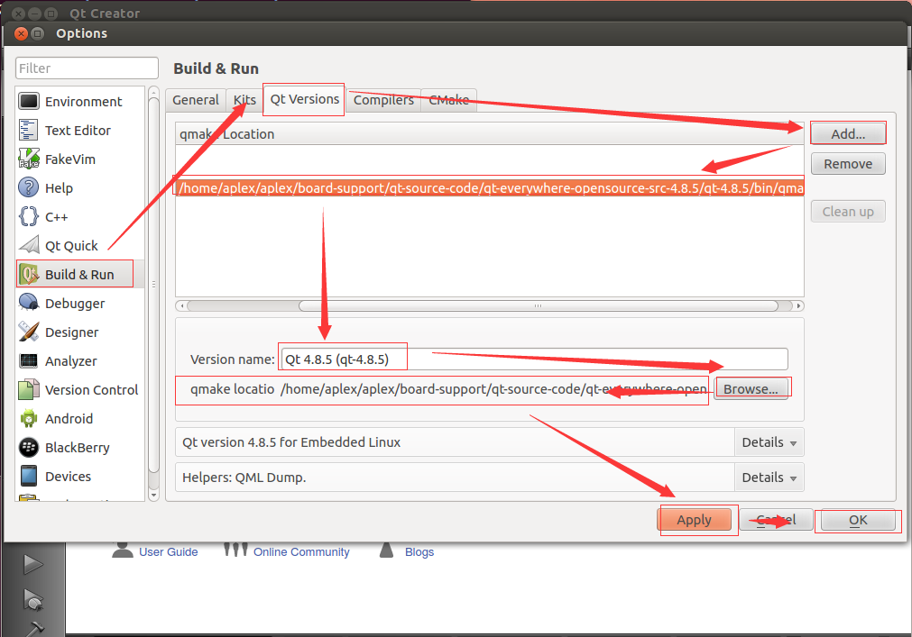

# SBC-7112S-Linux3.0.35-Qt4.8.5 User's Guide

## 一、说明

* 在阅读本文之前，请确保您已经阅读过[《SBC-7112S-Linux3.0.35-Qt4.8.5 Quick Start Guide》](Quick_Start_Guide.md)
* 如果您还没有硬件主板或者对应的开发BSP包，请跟我们的业务人员联系，他们将会向您提供相关硬件、软件资源。
* 本文涉及到的虚拟机操作，均以以下条件进行操作：
  * 采用VMware搭建的Ubuntu 12.04虚拟机；
  * 账户名：aplex；
  * 密码：aplex；
  * 以下执行的命令都是在VMware Ubuntu 12.04虚拟机中执行；
* 您作为本文档的阅读者，我们将假定您已经具备如下技能：
  * 熟悉并掌握Linux Shell命令；
  * 对Linux ARM交叉编译开发流程熟悉；
  * 对Qt Creator使用熟悉；

## 二、环境搭建、配置交叉编译器

* 使用VMware安装：Ubuntu 12.04 64位系统。  
如果您没有Ubuntu 12.04镜像，请使用BSP包中`board-support/VMware-Workstation/ubuntu-12.04-desktop-amd64.iso`镜像。
* 安装软件包，若果出现出错，请执行`sudo apt-get update`再继续：
```shell
    sudo apt-get update
    sudo apt-get install rpm 
    sudo apt-get install m4 
    sudo apt-get install bison 
    sudo apt-get install patch 
    sudo apt-get install build-essential 
    sudo apt-get install zlib1g 
    sudo apt-get install zlib1g-dev 
    sudo apt-get install ncurses-dev 
    sudo apt-get install texinfo 
    sudo apt-get install liblzo2-dev 
    sudo apt-get install uuid-dev 
    sudo apt-get install gettext 
    sudo apt-get install libglib2.0-dev
    sudo apt-get install tree
    sudo apt-get install ia32-libs                  # 由于是64位系统的原因
    sudo apt-get install libc6-dev-i386             # 由于是64位系统的原因
    sudo apt-get install autoconf automake libtool  # 编译tslib时要用到
```
* 在aplex用户目录下创建aplex目录，所有所有操作内容均是在该目录下操作：
  * `mkdir aplex`
  * `cd aplex`
* 创建编译器存放目录，并拷贝、解压编译器包，配置编译器路径：
  * `mkdir -p linux-devkit/compiler`
  * 将BSP包中`linux-devkit/compiler`中的编译器放入上面虚拟机`linux-devkit/compiler`的路径中,并解压：
```shell
    aplex@aplex:~/aplex$ ls linux-devkit/compiler/
    gcc-4.6.2-glibc-2.13-linaro-multilib-2011.12.tar.bz2
    aplex@aplex:~/aplex$ tar xvf gcc-4.6.2-glibc-2.13-linaro-multilib-2011.12.tar.bz2
    [...省略解压输出信息]
    aplex@aplex:~/aplex$ ls linux-devkit/compiler/
    gcc-4.6.2-glibc-2.13-linaro-multilib-2011.12
    gcc-4.6.2-glibc-2.13-linaro-multilib-2011.12.tar.bz2
    aplex@aplex:~/aplex$ 
```
 * 配置交叉编译器路径：
```shell
    aplex@aplex:~/aplex$ cat ~/.bashrc
    [...省略前面无关内容]

    export CROSS_COMPILE=arm-fsl-linux-gnueabi-
    export ARCH=arm

    export PATH=/home/aplex/aplex/linux-devkit/compiler/gcc-4.6.2-glibc-2.13-linaro-multilib-2011.12/fsl-linaro-toolchain/bin:$PATH
    export PATH=/home/aplex/aplex/board-support/u-boot-source-code/linux-uboot/tools:$PATH  # 编译linux kernel需要用到

    aplex@aplex:~$ 
```
* 测试交叉编译器是否正常：
```shell
    aplex@aplex:~/aplex$ source ~/.bashrc 
    aplex@aplex:~/aplex$ arm             # <---------- 这里按两次Tab键看效果
    arm2hpdl                             arm-linux-gdbtui
    arm-fsl-linux-gnueabi-addr2line      arm-linux-gprof
    arm-fsl-linux-gnueabi-ar             arm-linux-ld
    arm-fsl-linux-gnueabi-as             arm-linux-ld.bfd
    arm-fsl-linux-gnueabi-c++            arm-linux-ldd
    arm-fsl-linux-gnueabi-cc             arm-linux-nm
    arm-fsl-linux-gnueabi-c++filt        arm-linux-objcopy
    arm-fsl-linux-gnueabi-cpp            arm-linux-objdump
    arm-fsl-linux-gnueabi-ct-ng.config   arm-linux-populate
    arm-fsl-linux-gnueabi-elfedit        arm-linux-ranlib
    arm-fsl-linux-gnueabi-g++            arm-linux-readelf
    arm-fsl-linux-gnueabi-gcc            arm-linux-run
    arm-fsl-linux-gnueabi-gcc-4.6.2      arm-linux-size
    arm-fsl-linux-gnueabi-gcov           arm-linux-strings
    arm-fsl-linux-gnueabi-gdb            arm-linux-strip
    arm-fsl-linux-gnueabi-gdbtui         arm-none-linux-gnueabi-addr2line
    arm-fsl-linux-gnueabi-gprof          arm-none-linux-gnueabi-ar
    arm-fsl-linux-gnueabi-ld             arm-none-linux-gnueabi-as
    arm-fsl-linux-gnueabi-ld.bfd         arm-none-linux-gnueabi-c++
    arm-fsl-linux-gnueabi-ldd            arm-none-linux-gnueabi-c++filt
    arm-fsl-linux-gnueabi-nm             arm-none-linux-gnueabi-cpp
    arm-fsl-linux-gnueabi-objcopy        arm-none-linux-gnueabi-ct-ng.config
    arm-fsl-linux-gnueabi-objdump        arm-none-linux-gnueabi-elfedit
    arm-fsl-linux-gnueabi-populate       arm-none-linux-gnueabi-g++
    arm-fsl-linux-gnueabi-ranlib         arm-none-linux-gnueabi-gcc
    arm-fsl-linux-gnueabi-readelf        arm-none-linux-gnueabi-gcc-4.6.2
    arm-fsl-linux-gnueabi-run            arm-none-linux-gnueabi-gcov
    arm-fsl-linux-gnueabi-size           arm-none-linux-gnueabi-gdb
    arm-fsl-linux-gnueabi-strings        arm-none-linux-gnueabi-gdbtui
    arm-fsl-linux-gnueabi-strip          arm-none-linux-gnueabi-gprof
    arm-linux-addr2line                  arm-none-linux-gnueabi-ld
    arm-linux-ar                         arm-none-linux-gnueabi-ld.bfd
    arm-linux-as                         arm-none-linux-gnueabi-ldd
    arm-linux-c++                        arm-none-linux-gnueabi-nm
    arm-linux-c++filt                    arm-none-linux-gnueabi-objcopy
    arm-linux-cpp                        arm-none-linux-gnueabi-objdump
    arm-linux-ct-ng.config               arm-none-linux-gnueabi-populate
    arm-linux-elfedit                    arm-none-linux-gnueabi-ranlib
    arm-linux-g++                        arm-none-linux-gnueabi-readelf
    arm-linux-gcc                        arm-none-linux-gnueabi-run
    arm-linux-gcc-4.6.2                  arm-none-linux-gnueabi-size
    arm-linux-gcov                       arm-none-linux-gnueabi-strings
    arm-linux-gdb                        arm-none-linux-gnueabi-strip
    aplex@aplex:~/aplex$ arm
```
* 文件夹结构如下：
```shell
    aplex@aplex:~/aplex$ tree -L 3
    .
    └── linux-devkit
        └── compiler
            ├── gcc-4.6.2-glibc-2.13-linaro-multilib-2011.12
            └── gcc-4.6.2-glibc-2.13-linaro-multilib-2011.12.tar.bz2

    5 directories, 1 file
    aplex@aplex:~/aplex$ 
```

## 三、编译U-boot

* 虚拟机中创建`board-support/u-boot-source-code`目录：
```shell
    aplex@aplex:~/aplex$ ls
    board-support  linux-devkit
    aplex@aplex:~/aplex$ tree -L 3
    .
    ├── board-support
    │   └── u-boot-source-code
    └── linux-devkit
        └── compiler
            ├── gcc-4.6.2-glibc-2.13-linaro-multilib-2011.12
            └── gcc-4.6.2-glibc-2.13-linaro-multilib-2011.12.tar.bz2

    8 directories, 3 files
    aplex@aplex:~/aplex$ 
```
* 将BSP包中`board-support/u-boot-source-code`目录下的内核拷贝进虚拟机`board-support/u-boot-source-code`中，并解压tar包，目录情况如下：
```shell
    aplex@aplex:~/aplex$ tree -L 3
    .
    ├── board-support
    │   └── u-boot-source-code
    │       ├── linux-uboot
    │       └── linux-uboot.tar.gz
    └── linux-devkit
        └── compiler
            ├── gcc-4.6.2-glibc-2.13-linaro-multilib-2011.12
            └── gcc-4.6.2-glibc-2.13-linaro-multilib-2011.12.tar.bz2

    8 directories, 3 files
    aplex@aplex:~/aplex$ 
```
* 编译U-Boot：
  * `cd board-support/u-boot-source-code/linux-uboot`
  * `make distclean`
  * `make clean`
  * `make mx6dl_sabresd_android_config`
  * `make`
  * 查看U-Boot目录编译后结果：
```shell
    aplex@aplex:~/aplex/board-support/u-boot-source-code/linux-uboot$ ls
    api                            fs              lib_nios2    remake.sh
    board                          hacking         lib_ppc      rules.mk
    CHANGELOG                      include         lib_sh       System.map
    CHANGELOG-before-U-Boot-1.1.5  lib_arm         lib_sparc    tags
    common                         lib_avr32       MAINTAINERS  tools
    config.mk                      lib_blackfin    MAKEALL      u-boot
    COPYING                        libfdt          Makefile     u-boot.bin
    cpu                            lib_generic     mkconfig     u-boot.lds
    CREDITS                        lib_i386        nand_spl     u-boot.map
    disk                           lib_m68k        net          u-boot.srec
    doc                            lib_microblaze  onenand_ipl
    drivers                        lib_mips        post
    examples                       lib_nios        README
    aplex@aplex:~/aplex/board-support/u-boot-source-code/linux-uboot$ 
```

## 四、编译Linux Kernel

* 虚拟机中创建`board-support/linux-kernel-source-code`目录：
```shell
    aplex@aplex:~/aplex$ ls
    board-support  linux-devkit
    aplex@aplex:~/aplex$ tree -L 3
    .
    ├── board-support
    │   ├── linux-kernel-source-code
    │   └── u-boot-source-code
    │       ├── linux-uboot
    │       └── linux-uboot.tar.gz
    └── linux-devkit
        └── compiler
            ├── gcc-4.6.2-glibc-2.13-linaro-multilib-2011.12
            └── gcc-4.6.2-glibc-2.13-linaro-multilib-2011.12.tar.bz2

    8 directories, 3 files
    aplex@aplex:~/aplex$ 
```
* 将BSP包中`board-support/linux-kernel-source-code`目录下的内核拷贝进虚拟机`board-support/linux-kernel-source-code`中，并解压tar包：
```shell
    aplex@aplex:~/aplex$ ls
    board-support  linux-devkit
    aplex@aplex:~/aplex$ tree -L 3
    .
    ├── board-support
    │   ├── linux-kernel-source-code
    │   │   ├── linux_kernel
    │   │   └── linux_kernel.tar.gz
    │   └── u-boot-source-code
    │       ├── linux-uboot
    │       └── linux-uboot.tar.gz
    └── linux-devkit
        └── compiler
            ├── gcc-4.6.2-glibc-2.13-linaro-multilib-2011.12
            └── gcc-4.6.2-glibc-2.13-linaro-multilib-2011.12.tar.bz2

    6 directories, 2 files
    aplex@aplex:~/aplex$ 
```
* 编译Linux Kernel：
  * `cd board-support/linux-kernel-source-code/linux_kernel`
  * `make uImage`
  * 查看U-Boot目录编译后结果：
```shell
    aplex@aplex:~/aplex/board-support/linux-kernel-source-code/linux_kernel$ ls
    arch                    include      modules.builtin  sound
    block                   init         modules.order    System.map
    COPYING                 ipc          Module.symvers   tags
    CREDITS                 Kbuild       net              tools
    crypto                  Kconfig      README           usr
    Documentation           kernel       remake.sh        virt
    drivers                 lib          REPORTING-BUGS   vmlinux
    firmware                MAINTAINERS  samples          vmlinux.o
    fs                      Makefile     scripts
    imx6_android_defconfig  mm           security
    aplex@aplex:~/aplex/board-support/linux-kernel-source-code/linux_kernel$ 
```

## 五、Qt库编译

创建Qt源代码存放目录`board-support/qt-source-code`，并拷贝BSP包中`board-support/qt-source-code`的相关文件到该目录：
* `mkdir -p board-support/qt-source-code`
* 拷贝BSP包中相关Qt源代码到上面创建的目录中
* 如下是所需要的文件，解压tslib、Qt源代码包：
```bash
    aplex@aplex:~/aplex$ tree -L 3
    .
    ├── board-support
    │   ├── linux-kernel-source-code
    │   │   ├── linux_kernel
    │   │   └── linux_kernel.tar.gz
    │   ├── qt-source-code
    │   │   ├── qt-creator-linux-x86-opensource-2.8.1.run
    │   │   ├── qt-everywhere-opensource-src-4.8.5
    │   │   ├── qt-everywhere-opensource-src-4.8.5.tar.gz
    │   │   ├── run.sh
    │   │   ├── tslib-master
    │   │   └── tslib-master.zip
    │   └── u-boot-source-code
    │       ├── linux-uboot
    │       └── linux-uboot.tar.gz
    └── linux-devkit
        └── compiler
            ├── gcc-4.6.2-glibc-2.13-linaro-multilib-2011.12
            └── gcc-4.6.2-glibc-2.13-linaro-multilib-2011.12.tar.bz2

    11 directories, 7 files
    aplex@aplex:~/aplex$ 
```

### 5.1 编译tslib：
* `cd board-support/qt-source-code/tslib-master`
* `./autogen.sh` 
* `./configure --host=arm-linux --prefix /home/aplex/aplex/board-support/qt-source-code/tslib-master/_install`
* `make && make install`
* 查看编译结果：
```bash
    aplex@aplex:~/aplex/board-support/qt-source-code/tslib-master$ ls _install/
    bin  etc  include  lib
    aplex@aplex:~/aplex/board-support/qt-source-code/tslib-master$ 
```

### 5.2 编译Qt GUI库：
* `cd board-support/qt-source-code/qt-everywhere-opensource-src-4.8.5`
* `cp mkspecs/qws/linux-arm-gnueabi-g++ mkspecs/qws/linux-arm-fsl-gnueabi-g++ -r`
* 修改`mkspecs/qws/linux-arm-fsl-gnueabi-g++/qmake.conf`文件：
```shell
    aplex@aplex:~/aplex/board-support/qt-source-code/qt-everywhere-opensource-src-4.8.5$ cat mkspecs/qws/linux-arm-fsl-gnueabi-g++/qmake.conf 
    #
    # qmake configuration for building with arm-none-linux-gnueabi-g++
    #

    include(../../common/linux.conf)
    include(../../common/gcc-base-unix.conf)
    include(../../common/g++-unix.conf)
    include(../../common/qws.conf)

    # modifications to g++.conf
    QMAKE_CC                = arm-linux-gcc -lts
    QMAKE_CXX               = arm-linux-g++ -lts
    QMAKE_LINK              = arm-linux-g++ -lts
    QMAKE_LINK_SHLIB        = arm-linux-g++ -lts

    # modifications to linux.conf
    QMAKE_AR                = arm-linux-ar cqs
    QMAKE_OBJCOPY           = arm-linux-objcopy
    QMAKE_STRIP             = arm-linux-strip

    load(qt_config)
    aplex@aplex:~/aplex/board-support/qt-source-code/qt-everywhere-opensource-src-4.8.5$ 
```
* 修改`mkspecs/common/linux.conf`文件：
```shell
    aplex@aplex:~/aplex/board-support/qt-source-code/qt-everywhere-opensource-src-4.8.5$ cat mkspecs/common/linux.conf
    [...省略无关部分]

    QMAKE_LIBS            =
    QMAKE_LIBS_DYNLOAD    = -ldl
    QMAKE_LIBS_X11        = -lXext -lX11 -lm
    QMAKE_LIBS_X11SM      = -lSM -lICE
    QMAKE_LIBS_NIS        = -lnsl
    QMAKE_LIBS_EGL        = -lEGL
    QMAKE_LIBS_OPENGL     = -lGL
    QMAKE_LIBS_OPENGL_QT  = -lGL
    QMAKE_LIBS_OPENGL_ES1 = -lGLES_CM
    QMAKE_LIBS_OPENGL_ES2 = -lGLESv2
    QMAKE_LIBS_OPENVG     = -lOpenVG
    QMAKE_LIBS_THREAD     = -lpthread -lts     # <---- 修改这一行内容

    QMAKE_CFLAGS_WAYLAND =
    QMAKE_INCDIR_WAYLAND =
    QMAKE_LIBS_WAYLAND =
    QMAKE_LIBDIR_WAYLAND =
    QMAKE_DEFINES_WAYLAND =

    [...省略无关部分]
    aplex@aplex:~/aplex/board-support/qt-source-code/qt-everywhere-opensource-src-4.8.5$ 
```
* 运行如下shell命令：
```shell
    ./configure \
    -opensource \
    -confirm-license \
    -release \
    -shared \
    -embedded arm \
    -force-pkg-config \
    -xplatform qws/linux-arm-fsl-gnueabi-g++ \
    -depths 16,18,24,32 \
    -fast \
    -optimized-qmake \
    -pch \
    -qt-sql-sqlite \
    -qt-libjpeg \
    -qt-zlib \
    -qt-libpng \
    -qt-freetype \
    -little-endian -host-little-endian \
    -no-qt3support \
    -qt-libtiff -qt-libmng \
    -make translations \
    -qt-gfx-linuxfb -qt-gfx-transformed -qt-gfx-multiscreen \
    -no-gfx-vnc -no-gfx-qvfb -qt-kbd-linuxinput \
    -no-kbd-qvfb -armfpa  \
    -no-mouse-qvfb \
    -no-opengl \
    -no-mmx -no-sse -no-sse2 \
    -no-3dnow \
    -no-openssl \
    -webkit \
    -no-qvfb \
    -no-phonon \
    -no-nis \
    -no-opengl \
    -no-cups \
    -no-glib \
    -no-xcursor -no-xfixes -no-xrandr -no-xrender \
    -no-separate-debug-info \
    -nomake examples -make tools -nomake docs \
    -qt-mouse-tslib -DQT_QLOCALE_USES_FCVT \
    -I/home/aplex/aplex/board-support/qt-source-code/tslib-master/_install/include \
    -L/home/aplex/aplex/board-support/qt-source-code/tslib-master/_install/lib \
    -importdir /usr/local/Trolltech/QtEmbedded-4.8.5-arm/qml 
```
* 执行`make`，这里可能要等很久，跟主机配置有关。
* 执行`sudo make install`，文件存放在`/usr/local/Trolltech/QtEmbedded-4.8.5-arm/`中:
```shell
    aplex@aplex:/usr/local/Trolltech/QtEmbedded-4.8.5-arm$ ls
    bin  include  lib  mkspecs  phrasebooks  plugins  q3porting.xml  qml  tests  translations
    aplex@aplex:/usr/local/Trolltech/QtEmbedded-4.8.5-arm$ 

```

### 5.3 安装Qt Creator
* 执行`mkdir -p board-support/qt-source-code/qt-creator`
* 执行`./board-support/qt-source-code/qt-creator-linux-x86-opensource-2.8.1.run`
* 在选择安装目录的时候，选择'/home/aplex/aplex/board-support/qt-source-code/qt-creator'
```shell
    aplex@aplex:~/aplex/board-support/qt-source-code/qt-creator$ pwd
    /home/aplex/aplex/board-support/qt-source-code/qt-creator
    aplex@aplex:~/aplex/board-support/qt-source-code/qt-creator$ ls
    bin                  lib          QtCreatorUninstaller      share
    components.xml       Licenses     QtCreatorUninstaller.dat
    InstallationLog.txt  network.xml  QtCreatorUninstaller.ini
    aplex@aplex:~/aplex/board-support/qt-source-code/qt-creator$ 
```
* 配置Shell环境变量：
```shell
    aplex@aplex:~$ cat .bashrc 
    [...省略无关内容]

    export CROSS_COMPILE=arm-fsl-linux-gnueabi-
    export ARCH=arm

    export PATH=/home/aplex/aplex/linux-devkit/compiler/gcc-4.6.2-glibc-2.13-linaro-multilib-2011.12/fsl-linaro-toolchain/bin:$PATH
    export PATH=/home/aplex/aplex/board-support/u-boot-source-code/linux-uboot/tools:$PATH
    export PATH=/home/aplex/aplex/board-support/qt-source-code/qt-creator/bin:$PATH  # 将qtcreator添加进PATH中

    aplex@aplex:~$ 
```
* 打开Qt Creator配置选项，命令行执行`qtcreator`：
 
* Qt Creator添加编译器，Compiler path选择`/home/aplex/aplex/linux-devkit/compiler/gcc-4.6.2-glibc-2.13-linaro-multilib-2011.12/fsl-linaro-toolchain/bin/arm-fsl-linux-gnueabi-g++`：
 
* Qt Creator添加qmake工具，qmake location选择`/usr/local/Trolltech/QtEmbedded-4.8.5-arm/bin/qmake`：
 
* Qt Creator添加编译kit：
 
* 如下是使用Qt Creator编译Qt Gui Application项目helloworld成功：
 

## 六、Examples SDK Documents

[SBC-7112S-FullTest-Qt4.8.5](https://github.com/AplexOS/Qt-Examples/blob/SBC-7112S-FullTest-Qt4.8.5/README.md)

## 七、如何使用我们的VMware Workstation 

虚拟机存放在BSP包的`board-support/VMware-Workstation`目录下。如果没有BSP包，请您与我们的业务人员联系，他们会向您提供必要的帮助。

### 7.1 登录信息：

* username: aplex
* passwd: aplex

### 7.2 源代码目录大致如下

```
    aplex@aplex:~/aplex$ pwd
    /home/aplex/aplex
    aplex@aplex:~/aplex$ tree -L 3
    .
    ├── board-support
    │   ├── linux-kernel-source-code
    │   │   ├── linux_kernel
    │   │   └── linux_kernel.tar.gz
    │   ├── qt-source-code
    │   │   ├── qt-creator
    │   │   ├── qt-creator-linux-x86-opensource-2.8.1.run
    │   │   ├── qt-everywhere-opensource-src-4.8.5
    │   │   ├── qt-everywhere-opensource-src-4.8.5.tar.gz
    │   │   ├── run.sh
    │   │   ├── tslib-master
    │   │   └── tslib-master.zip
    │   └── u-boot-source-code
    │       ├── linux-uboot
    │       └── linux-uboot.tar.gz
    ├── example-applications
    │   └── readme.txt
    └── linux-devkit
        └── compiler
            ├── gcc-4.6.2-glibc-2.13-linaro-multilib-2011.12
            └── gcc-4.6.2-glibc-2.13-linaro-multilib-2011.12.tar.bz2

    45 directories, 367 files
    aplex@aplex:~/aplex$ 
```

## 八、版权说明

以上所有内容最终解释权归[aplex](http://www.aplextec.com/cn/home.php)公司所有。

