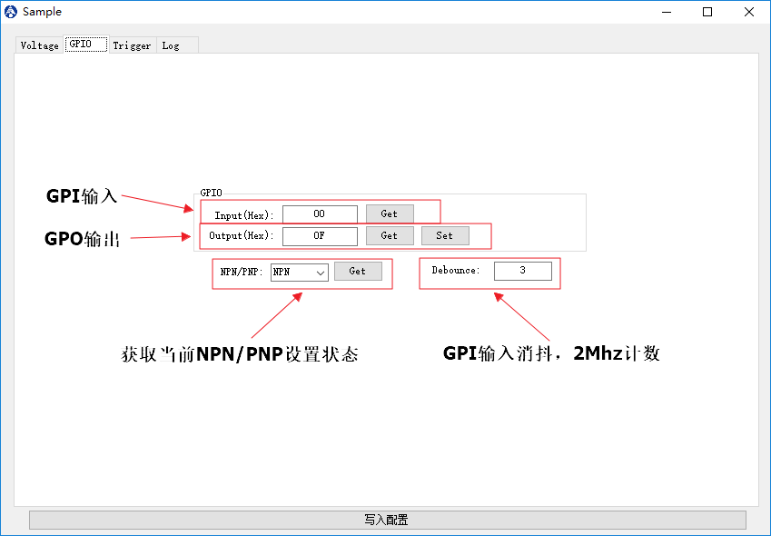

# GPIO

## 界面

## 操作说明

* GPI输入：通用IO输入；
  * `Input（Hex）`：以十六进制显示；
    * 范围：8bit；
    * `Get` 按键：用来获取当前GPI输入的值；
* GPO输输出：通用IO输出；
  * `Output（Hex）`：以十六进制显示；
    * 范围：8bit；
    * `Get` 按键：用来获取当前GPO输出的值；
    * `Set` 按键：用来设定当前GPO输出的值；
* `NPN/PNP`：显示当前硬件拨码是NPN还是PNP类型；
    * `Get` 按键：用来获取当NPN/PNP状态；
* `Debounce`：设置GPI输入的消抖计数值，以2MHz为计数单位进行计数；
