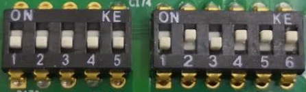

# 示例程序说明

主要列出示例程序界面、各项配置操作说明；

## 硬件拨码

### 默认拨码

### 简要说明

* 第一个拨码器：
  * `1` 号拨码对应光源4，`ON`为常亮，`OFF`为光源输出；
  * `2` 号拨码对应光源3，`ON`为常亮，`OFF`为光源输出；
  * `3` 号拨码对应光源2，`ON`为常亮，`OFF`为光源输出；
  * `4` 号拨码对应光源1，`ON`为常亮，`OFF`为光源输出；
  * `5` 号暂未使用；
* 第二个拨码器：
  * `1 ~ 4` 号拨码不要动，**保持该默认值**；
  * `5 ~ 6` 号拨码表示`NPN/PNP`选择，`ON`为`NPN`，`OFF`为`PNP`；

## 软件内容列表

* [光源、GPIO、触发、日志界面展示](MainPage.md)
* [光源设置界面说明](Light.md)
* [GPIO设置界面说明](GPIO.md)
* [触发逻辑设置界面说明](Trigger.md)
* [日志输出界面说明](Log.md)
