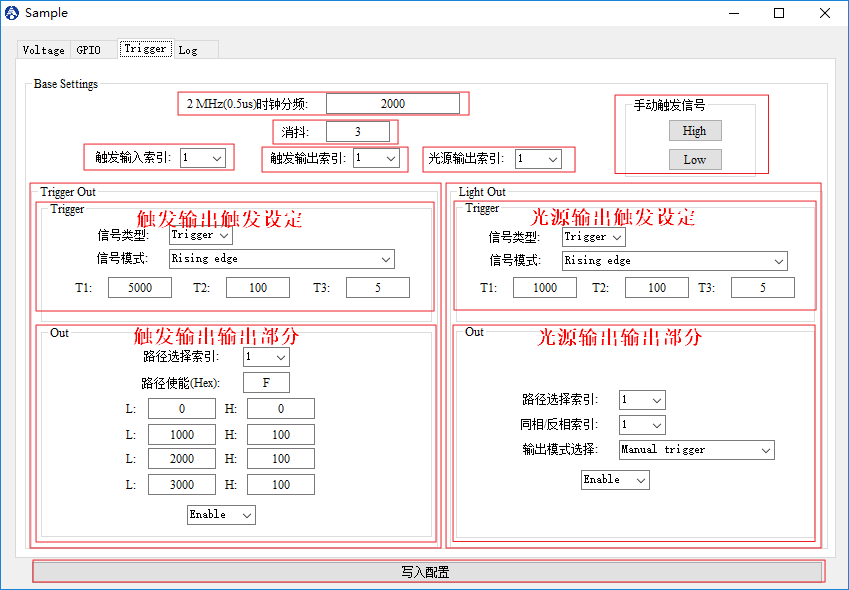

# 触发逻辑设定

## 界面

## 操作说明

* `2MHz(0.5us)时钟分频`：触发逻辑部分目前采用2MHz时钟，这里的分频系数要大于等于2；
* `消抖`：采用的2MHz时钟计数，**采用未分频时钟**；
* `触发输入索引`：选择当前设定哪一路触发输入；
* `触发输出索引`：选择当前设定哪一路触发输出；
* `光源输出索引`：选择当前设定哪一路光源输出；
* `手动触发信号`
  * 以`触发输入索引`为索引，作为手动触发信号操作源；
  * `High` 按钮：将触发输入信号模拟拉高；
  * `Low` 按钮：将触发输入信号模拟拉低；
* `Trigger Out`：触发输出部分
  * `Trigger`：触发配置部分
    * `信号类型`：Manal（手动触发）、Trigger（外部触发）；
    * `信号模式`：Rising edge（上升沿触发）、Falling edge（下降沿触发）、High Level（高电平持续触发）、Low Level（低电平持续触发）、Adjustable number of rising edges（上升沿可调次数触发）、Adjustable number of falling edges（下降沿可调次数触发）；
    * `T1`：触发计数T1，对分频后的时钟进行计数；
    * `T2`：触发计数T2，对分频后的时钟进行计数；
    * `T3`：触发计数T3，**在可调次数模式下作为次数计数**，对分频后的时钟进行计数；
  * `Out`：触发输出配置部分
    * `路径选择索引`：触发输入源索引选择，该信号源提供给四路脉冲发生器；
    * `路径使能（Hex）`：以十六进制表示四路脉冲输出选择；
    * `L`：低电平持续计数，对分频后的时钟进行计数，第一行的`L`表示第一个脉冲发生器的低电平计数，以此类推，共四路；
    * `H`：高电平持续计数，对分频后的时钟进行计数，第一行的`H`表示第一个脉冲发生器的高电平计数，以此类推，共四路；
    * `Enable/Disable`：使能/禁用当前触发输出；
* `Light Out`：光源输出部分
  * `Trigger`：触发配置部分
    * `信号类型`：Manal（手动触发）、Trigger（外部触发）；
    * 信号模式：Rising edge（上升沿触发）、Falling edge（下降沿触发）、High Level（高电平持续触发）、Low Level（低电平持续触发）、Adjustable number of rising edges（上升沿可调次数触发）、Adjustable number of falling edges（下降沿可调次数触发）；
    * `T1`：触发计数T1，对分频后的时钟进行计数；
    * `T2`：触发计数T2，对分频后的时钟进行计数；
    * `T3`：触发计数T3，**在可调次数模式下作为次数计数**，对分频后的时钟进行计数；
  * `Out`：触发输出配置部分
    * `路径选择索引`：触发输入源索引选择；
    * `同相/反相索引`：在`输出模式选择`为`同相`或者`反相`输出的情况的输入索引；
    * `输出模式选择`：Manual trigger（手动触发输出）、External trigger（外部触发输出）、Non-inverting output（同相输出）、Inverting output（反相输出）；
    * `Enable/Disable`：使能/禁用当前触发输出；
* `写入配置`：写入寄存器，并保存数据到掉电保持存储器中；
