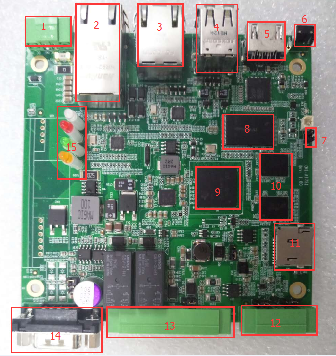
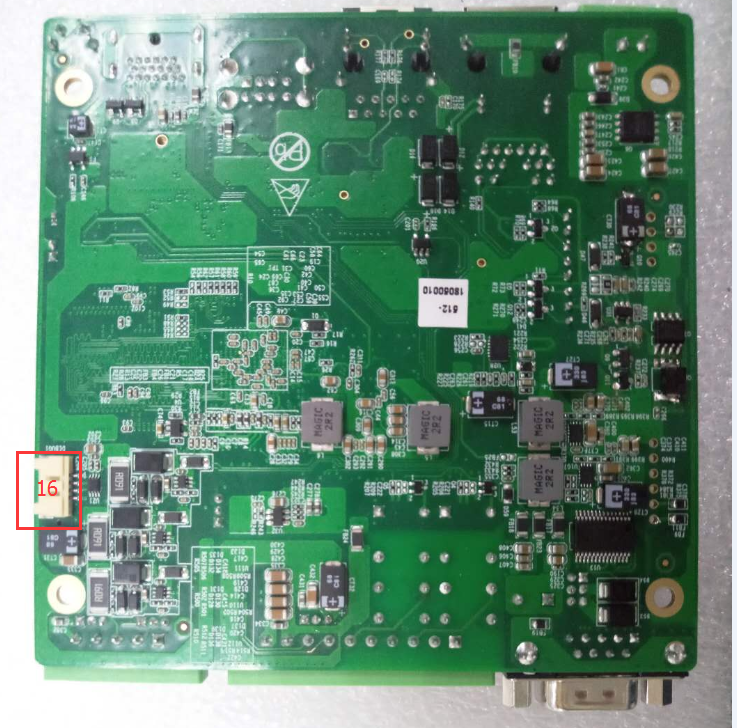
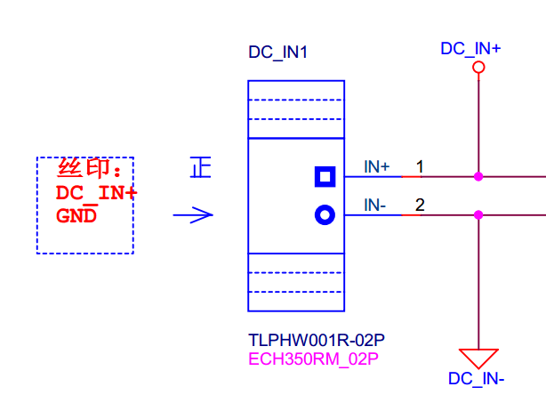
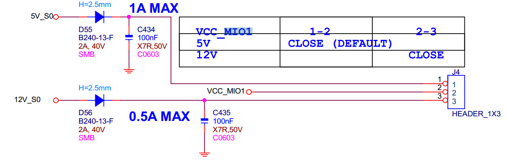
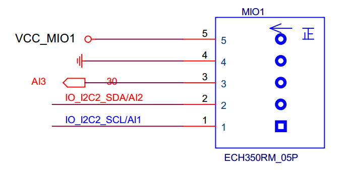
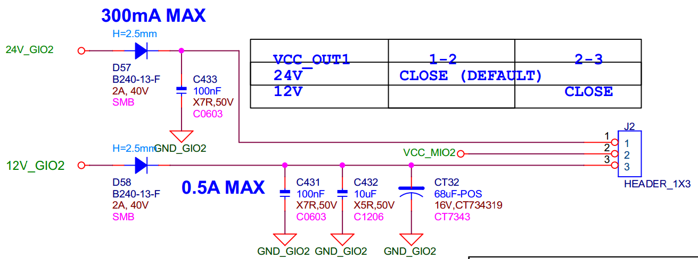
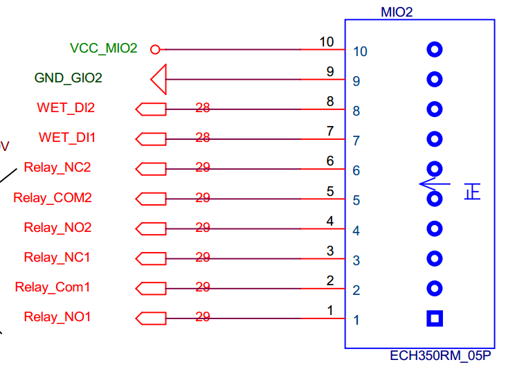
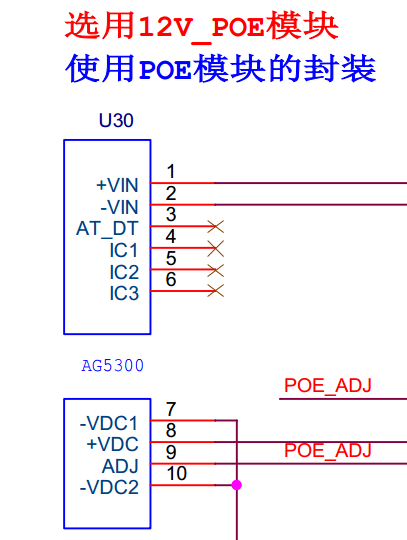
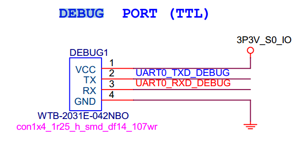

# CMI_AT751 硬件简介:

## 一、硬件简介
  
  
  * 1. 9-26V DC_IN
  * 2. POE 百兆有线网口 0
  * 3. 百兆有线网口 1
  * 4. USB typeA
  * 5. HDMI
  * 6. RESET_IP button
  * 7. J1 jump
  * 8. NandFlash
  * 9. TI-AM3354
  * 10. DDR
  * 11. SD slot
  * 12. MIO1
  * 13. MIO2
  * 14. DB9
  * 15. LED
  * 16. debug port

## 二、 部分硬件原理图如下：
  ### 1. DC_IN(9-36V)
    
  DC_IN 为 9-36V 宽电压输入
  ### 2. MIO1
  
  
  MIO1 VCC 可以通过
  ### 3. MIO2
  
  
  ### 4. POE 模块
  
  ### 5. debug port
  
