# QT5.6.2 的移植与使用

## 一、源代码的下载
* QT5.6.2 下载
```sh
cd ~/aplex
wget http://download.qt.io/archive/qt/5.6/5.6.2/single/qt-everywhere-opensource-src-5.6.2.tar.gz
tar xvf qt-everywhere-opensource-src-5.6.2.tar.gz
```
* qtwebkit 模块源代码的下载
```sh
cd ~/aplex
wget http://sources.buildroot.net/qtwebkit-opensource-src-5.6.2.tar.xz
# qtwebkit-opensource-src-5.6.2.tar.xz  移动到 QT 源代码目录，, 并解压
mv qtwebkit-opensource-src-5.6.2.tar.xz qt-everywhere-opensource-src-5.6.2
tar -xvf qtwebkit-opensource-src-5.6.2.tar.xz
sync
```
* 必要的软件安装
```sh
sudo apt-get install gperf bison ruby flex
```

## 二、 QT5.6.2 交叉编译前的配置
* 进入 QT5.6.2 源代码目录，删除 qtwebengine 模块代码目录
```sh
cd  ~/aplex/qt-everywhere-opensource-src-5.6.2/
rm qtwebengine -rf
sync
```

* 修改Q的配置文件内容如下：
```sh
  # cat qt-everywhere-opensource-src-5.6.2/qtbase/mkspecs/devices/linux-beagleboard-g++/qmake.conf（为方便操作，可以直接替换内容）
  include(../../common/linux.conf)
  include(../../common/gcc-base-unix.conf)
  include(../../common/g++-unix.conf)

  load(device_config)

  QT_QPA_DEFAULT_PLATFORM = eglfs

  # modifications to g++.conf
  QMAKE_CC                = $${CROSS_COMPILE}gcc
  QMAKE_CXX               = $${CROSS_COMPILE}g++
  QMAKE_LINK              = $${QMAKE_CXX}
  QMAKE_LINK_SHLIB        = $${QMAKE_CXX}

  # modifications to linux.conf
  QMAKE_AR                = $${CROSS_COMPILE}ar cqs
  QMAKE_OBJCOPY           = $${CROSS_COMPILE}objcopy
  QMAKE_NM                = $${CROSS_COMPILE}nm -P
  QMAKE_STRIP             = $${CROSS_COMPILE}strip

  COMPILER_FLAGS          = -march=armv7-a -mtune=cortex-a8 -mfpu=neon -mthumb

  #modifications to gcc-base.conf
  QMAKE_CFLAGS           += $${COMPILER_FLAGS}
  QMAKE_CXXFLAGS         += $${COMPILER_FLAGS}
  QMAKE_CXXFLAGS_RELEASE += -O3

  QMAKE_LIBS             += -lrt -lpthread -ldl

  # Extra stuff (OpenGL, DirectFB, ...)
  QMAKE_INCDIR_EGL        =
  QMAKE_LIBDIR_EGL        =
  QMAKE_INCDIR_OPENGL_ES2 = $${QMAKE_INCDIR_EGL}
  QMAKE_LIBDIR_OPENGL_ES2 = $${QMAKE_LIBDIR_EGL}
  QMAKE_INCDIR_OPENVG     = $${QMAKE_INCDIR_EGL}
  QMAKE_LIBDIR_OPENVG     = $${QMAKE_LIBDIR_EGL}

  QMAKE_LIBS_EGL          = -lEGL -lIMGegl -lsrv_um
  QMAKE_LIBS_OPENGL_ES2   = -lGLESv2 $${QMAKE_LIBS_EGL}
  QMAKE_LIBS_OPENVG       = -lOpenVG $${QMAKE_LIBS_EGL}

  DISTRO_OPTS += hard-float

  # No need for any special EGL device integration.
  # Prioritize the default, compiled-in integration over any plugins.
  EGLFS_DEVICE_INTEGRATION = none

  include(../common/linux_arm_device_post.conf)

  load(qt_config)
```

* 在qt根目录下创建配置自动配置脚本(au_build.sh)，内如如下：
```sh
  cd qt-everywhere-opensource-src-5.6.2
	cat au_build.sh
	#!/bin/sh                                                              
  ./configure \
    -v -opensource \
    -confirm-license \
    -pch \
    -qt-sql-sqlite \
    -qt-zlib \
    -prefix  /home/am335x/qt5 \
    -release \
    -fontconfig \
    -opengl es2 -make libs -device linux-beagleboard-g++ \
    -device-option  CROSS_COMPILE=/home/cmi_at751/ti/linux-devkit/sysroots/x86_64-arago-linux/usr/bin/arm-linux-gnueabihf- \
    -sysroot /home/cmi_at751/ti/linux-devkit/sysroots/armv7ahf-neon-linux-gnueabi \
    -linuxfb  \
    -eglfs \
    -no-gcc-sysroot \
    -make examples -make tools -nomake tests
```

* 注意：
```sh
“-device-option  CROSS_COMPILE=” 写上ti工具包提供的交叉编译工具链
“-sysroot”后面跟的是ti工具包中的根文件系统
“-device” 后面跟的是QT的配置文件
“-prefix” 后面跟的是QT的安装目录   
根据自己创建的目录合理更改上述选项
```

* 编译
```sh
    make -j4  && make install
```    

## 三、在PC机上将编译好的QT库和相关插件打包
* 打包QT库
```sh
  cd   /home/cmi-at751/cmi_at751/qt/qt_arm
  tar  cvf qt5.tar  lib/ plugins/ bin/ qml/ translations/
```

* 将QT库依赖的外部库拷贝到开发板相应位置，内容如下：
```sh
  cat qt_lib_cp.sh

	#! /bin/sh
  lib_src=/home/cmi-at751/ti-processor-sdk-linux-am335x-evm-03.03.00.04/filesystem/test
  lib_des=/home/cmi-at751/cmi_at751/filesystem/rootfs

  sudo cp $lib_src/etc/qt5/   $lib_des/etc/ -rf
  sudo cp $lib_src/etc/ssl/   $lib_des/etc/ -rf
  sudo cp $lib_src/usr/lib/ssl/   $lib_des/usr/lib/ -rf

  sudo cp $lib_src/etc/fonts    $lib_des/etc -rf
  sudo cp $lib_src/usr/lib/fonts    $lib_des/usr/lib/ -rf
  sudo cp $lib_src/usr/share/fonts    $lib_des/usr/share/ -rf

  sudo cp $lib_src/usr/lib/libpng16*   $lib_des/usr/lib/ -rf
  sudo cp $lib_src/usr/lib/libicui18n* $lib_des/usr/lib/ -rf
  sudo cp $lib_src/usr/lib/libicuuc.*   $lib_des/usr/lib/ -rf
  sudo cp $lib_src/usr/lib/libicudata.*  $lib_des/usr/lib/ -rf
  sudo cp $lib_src/usr/lib/libgthread-2.0.*  $lib_des/usr/lib/ -rf
  sudo cp $lib_src/usr/lib/libglib-2.0.*    $lib_des/usr/lib/ -rf
  sudo cp $lib_src/usr/lib/libpcre.so.*     $lib_des/usr/lib/ -rf
  sudo cp $lib_src/usr/lib/libfontconfig*    $lib_des/usr/lib/ -rf
  sudo cp $lib_src/usr/lib/libfreetype*     $lib_des/usr/lib/ -rf
  sudo cp $lib_src/usr/lib/libexpat*         $lib_des/usr/lib/ -rf
  sudo cp $lib_src/usr/lib/libdbus-*       $lib_des/usr/lib/ -rf
  sudo cp $lib_src/usr/lib/liblzma.*         $lib_des/usr/lib/ -rf
  sudo cp $lib_src/lib/libsystemd.*   $lib_des/lib/ -rf
  sudo cp $lib_src/usr/lib/libtiff.so*   $lib_des/usr/lib/ -rf
  sudo cp $lib_src/usr/lib/libjpeg.so*   $lib_des/usr/lib/ -rf
  sudo cp $lib_src/usr/lib/libwebp.so*   $lib_des/usr/lib/ -rf

  sudo cp $lib_src/usr/lib/libgsttag-1.0.so*   $lib_des/usr/lib/ -rf
  sudo cp $lib_src/usr/lib/liborc-0.4.so.0*   $lib_des/usr/lib/ -rf
  sudo cp $lib_src/usr/lib/libxslt.so.1*   $lib_des/usr/lib/ -rf
  sudo cp $lib_src/usr/lib/libxml2.so.2*   $lib_des/usr/lib/ -rf
  sudo cp $lib_src/usr/lib/libgio-2.0.so.0*   $lib_des/usr/lib/ -rf
  sudo cp $lib_src/usr/lib/libgmodule-2.0.so.0*   $lib_des/usr/lib/ -rf
  sudo cp $lib_src/usr/lib/libgstapp-1.0.so.0*   $lib_des/usr/lib/ -rf
  sudo cp $lib_src/usr/lib/libgstpbutils-1.0.so.0*   $lib_des/usr/lib/ -rf
  sudo cp $lib_src/usr/lib/libgstvideo-1.0.so.0*   $lib_des/usr/lib/ -rf
  sudo cp $lib_src/usr/lib/libgstaudio-1.0.so.0*   $lib_des/usr/lib/ -rf
  sudo cp $lib_src/usr/lib/libgstbase-1.0.so.0*   $lib_des/usr/lib/ -rf
  sudo cp $lib_src/usr/lib/libgstreamer-1.0.so.0*   $lib_des/usr/lib/ -rf
  sudo cp $lib_src/usr/lib/libgobject-2.0.so.0*   $lib_des/usr/lib/ -rf
  sudo cp $lib_src/usr/lib/libsqlite3.so.0*   $lib_des/usr/lib/ -rf

  sudo cp $lib_src/etc/init.d/rc.pvr    $lib_des/etc/init.d/ -rf
  sudo cp $lib_src/usr/bin/pvrsrvctl    $lib_des/usr/bin/pvrsrvctl -rf
  sudo cp $lib_src/usr/lib/libwayland*    $lib_des/usr/lib/ -rf
  sudo cp $lib_src/usr/lib/libattr.*    $lib_des/usr/lib/ -rf
  sudo cp $lib_src/usr/lib/libGLES*    $lib_des/usr/lib/ -rf
  sudo cp $lib_src/usr/lib/gbm/    $lib_des/usr/lib/ -rf
  sudo cp $lib_src/usr/lib/libpvr*    $lib_des/usr/lib/ -rf
  sudo cp $lib_src/usr/lib/libdrm*    $lib_des/usr/lib/ -rf
  sudo cp $lib_src/usr/lib/libgbm.*    $lib_des/usr/lib/ -rf
  sudo cp $lib_src/usr/lib/libudev.*    $lib_des/usr/lib/ -rf
  sudo cp $lib_src/usr/lib/libsrv_*  $lib_des/usr/lib/ -rf
  sudo cp $lib_src/usr/lib/libEGL*    $lib_des/usr/lib/ -rf
  sudo cp $lib_src/usr/lib/libIMGegl*    $lib_des/usr/lib/ -rf
  sudo cp $lib_src/usr/lib/libdbm*   $lib_des/usr/lib/ -rf
  sudo cp $lib_src/usr/lib/libglslcompiler*  $lib_des/usr/lib/ -rf
  sudo cp $lib_src/usr/lib/libpthread*    $lib_des/usr/lib/ -rf
  sudo cp $lib_src/usr/lib/libusc*  $lib_des/usr/lib/ -rf
  sudo cp $lib_src/lib/libudev.*    $lib_des/lib/ -rf
  sudo cp $lib_src/usr/bin/modetest $lib_des/usr/bin -rf
  sudo cp $lib_src/usr/bin/kms*  $lib_des/usr/bin -rf
  sudo cp $lib_src/lib/libattr.*    $lib_des/lib/ -rf
  sudo cp $lib_src/lib/libcap.so*   $lib_des/lib/ -rf && echo ok
```

## 四、在开发板上配置QT
* 将压缩包qt5.tar拷贝到开发板上并在开发板上解压，参考命令如下：
```sh
  1.  mkdir /usr/local   #如果已存在无需重建
  2.  cd /usr/local/ && mkdir qt5 && tar xvf qt5.tar -C qt5/
```
* 在开发板上配置QT，在/etc/profile文件末尾添加如下内容：
```sh
  export QTDIR=/usr/local/qt5
  export QT_QPA_PLATFORM_PLUGIN_PATH=/usr/local/qt5/plugins
  export QT_QPA_PLATFORM=eglfs:fb=/dev/fb0
  export QT_QPA_FONTDIR=/usr/local/qt5/lib/fonts
  export QT_QPA_GENERIC_PLUGINS=evdevtablet:/dev/input/event0
  #export QT_QPA_EVDEV_MOUSE_PARAMETERS=/dev/input/event0
  export LD_LIBRARY_PATH=/usr/local/qt5/lib:$LD_LIBRARY_PATH
  export QML2_IMPORT_PATH=$QTDIR/qml
  #export QT_DEBUG_PLUGINS=1
  export PATH=/usr/local/qt5/bin:$PATH
  export SSL_CERT_FILE=/etc/ssl/certs/ca-certificates.crt
  export QT_QPA_EGLFS_KMS_CONFIG=/etc/qt5/eglfs_kms_cfg.json
```
* 配置开发板开机自启动QT程序，创建自启动脚本/etc/init.d/S91qt_set，内容如下：
```sh
  #! /bin/sh
  /etc/init.d/rc.pvr start
  export QTDIR=/usr/local/qt5
  export QT_QPA_PLATFORM_PLUGIN_PATH=/usr/local/qt5/plugins
  export QT_QPA_PLATFORM=eglfs:fb=/dev/fb0
  export QT_QPA_FONTDIR=/usr/local/qt5/lib/fonts
  export QT_QPA_GENERIC_PLUGINS=evdevtablet:/dev/input/event0
  #export QT_QPA_EVDEV_MOUSE_PARAMETERS=/dev/input/event0
  export LD_LIBRARY_PATH=/usr/local/qt5/lib:$LD_LIBRARY_PATH
  export QML2_IMPORT_PATH=$QTDIR/qml
  #export QT_DEBUG_PLUGINS=1
  export PATH=/usr/local/qt5/bin:$PATH
  export SSL_CERT_FILE=/etc/ssl/certs/ca-certificates.crt
  export QT_QPA_EGLFS_KMS_CONFIG=/etc/qt5/eglfs_kms_cfg.json
  calendar &

  注意：calendar 是一个QT程序 &表示后台运行
```
* 配置QT支持中文：
```sh
  1：在ubuntu上查找tty结尾的中文字体库，输入如下命令，如下图一所示：
  fc-list :lang=zh-cn
  2：将DroidSansFallbackFull.ttf文件拷贝到开发板上的字体库文件夹中
  3：看看QT能否显示中文，若果不能显示中文，则删除图2所示文件夹（ttf）中的其他的所有字体文件，就像图2一样。
```
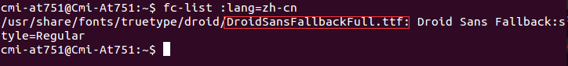
```sh
图一：CN-font
```
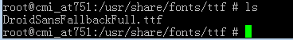
```sh
图2：ttf
```

## 五、在PC机上安装Qt5.6.2开发软件
* 安装必要软件库：
```sh
  sudo apt-get install libgl1-mesa-dev
```
* ubuntu安装Qt5.6.2开发软件：
```sh
  Wet http://download.qt.io/archive/qt/5.6/5.6.2/qt-opensource-linux-x64-5.6.2.run
  chmod +x qt-opensource-linux-x64-5.6.2.run
  ./qt-opensource-linux-x64-5.6.2.run
```


## 六、搭建QT5.6.2的交叉编译环境
* 配置PC机QT开发软件的arm版本qmake，参见图5.1。

    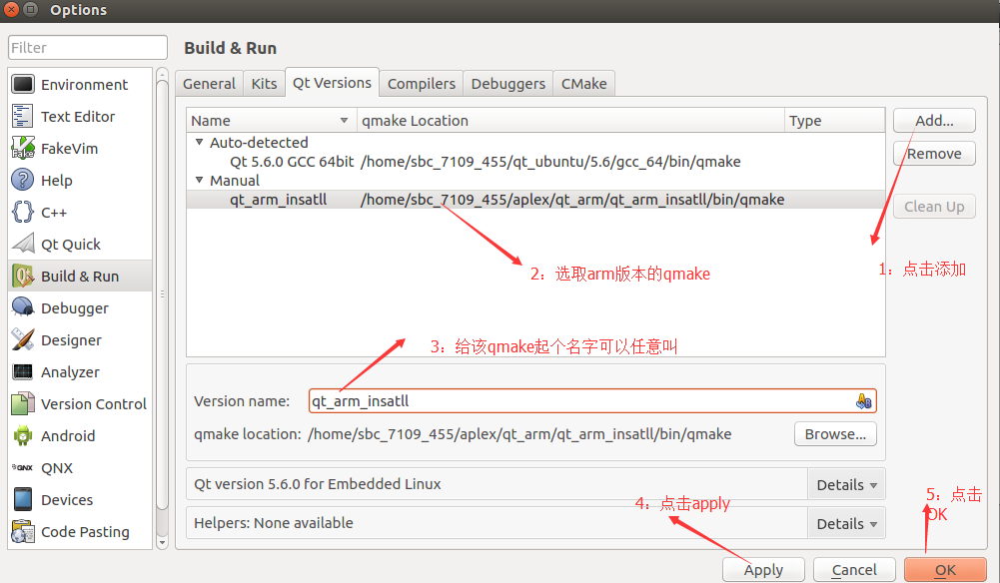
```sh
图5.1 arm版本qmake的配置步骤

  如图7.5.1所示，首先打开QtCreator->Tools->Options->Build &Run ->
Qt Version，点击add在version name输入名字(随便写一个)，在 qmake location中填入ARM版本qmake的绝对路径
```

* 配置PC机QT开发软件的arm版本交叉编译工具链，参见图5.2

    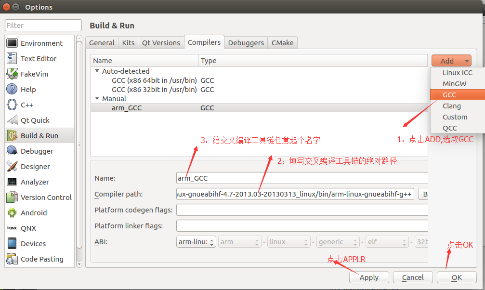
```sh
图5.2 arm版本交叉编译工具链的配置步骤

  如图7.5.2所示，首先打开QtCreator->Tools->Options->Build &Run -> Compieirs，点击add->gcc，添加交叉
编译工具链，在Name中输入名字，Complier path中输入你的交叉	编译工具链在linux上的绝对路径
```
* 配置PC机QT开发软件的arm版本Kits工具，参见图5.3

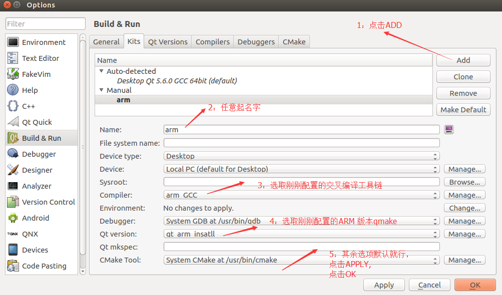
```sh
图5.3 arm版本Kits工具配置步骤

    如图7.5.3所示，首先打开QtCreator->Tools->Options->Build &Run -> Kits，点击Add、在Complier处选择
刚才配置好的交叉编译工具链的名字，在Qt Version处选择刚才配置好的qmake的名字，点击apply，OK。
```
## 七、编译arm板QT程序（此步骤是工程模板）
* 在PC机上编译一个arm版本QT程序小实例，步骤如以下图
片所示。

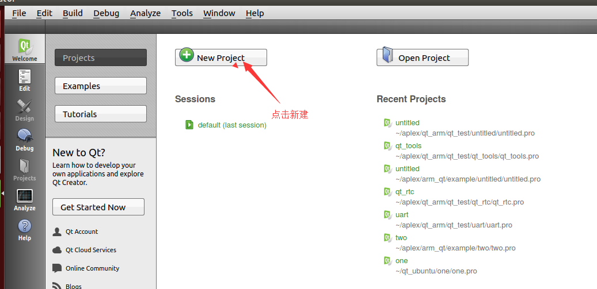
```sh
图 6.1 创建一个qt项目
```

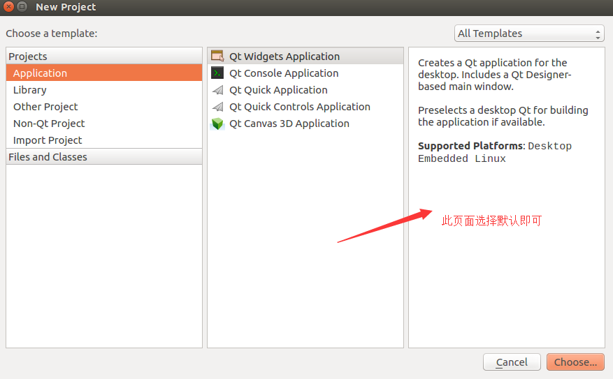
```sh
图 6.2
```

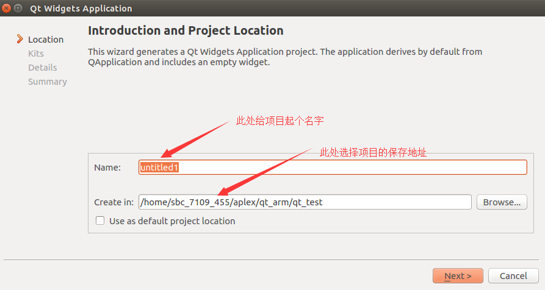
    
```sh
图 6.3所示，在此页面指定项目名称和项目所在路径。
```

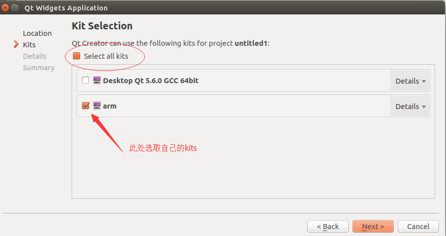
```sh
图 6.4所示，在此页面选取上一小节中配置的交叉编译工具链
```

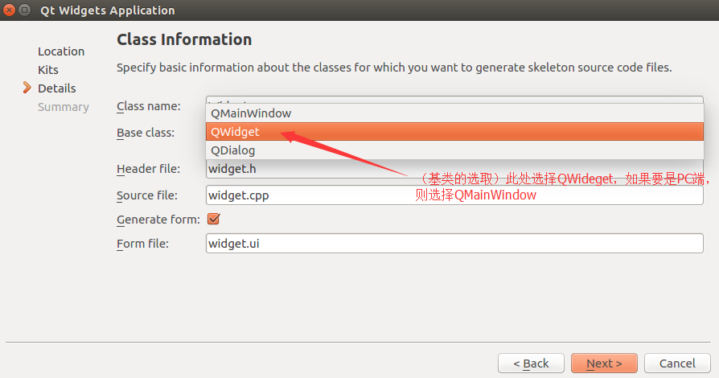
```sh
图 6.5所示，在此页面选取窗口基类
```

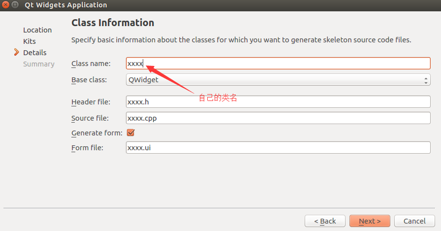
```sh
图 6.6所示，在此页面中确定自己的类名
```

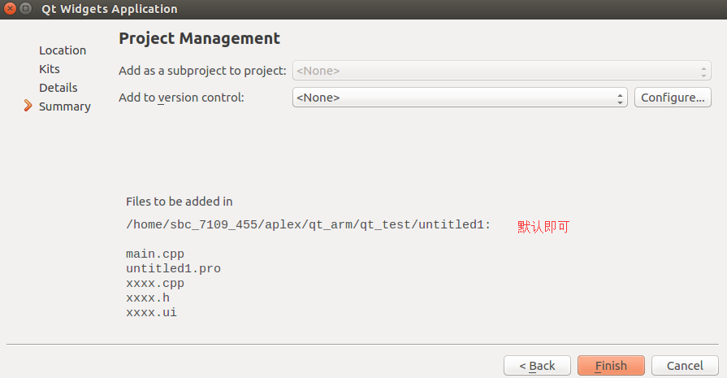
```sh
图 6.7
```

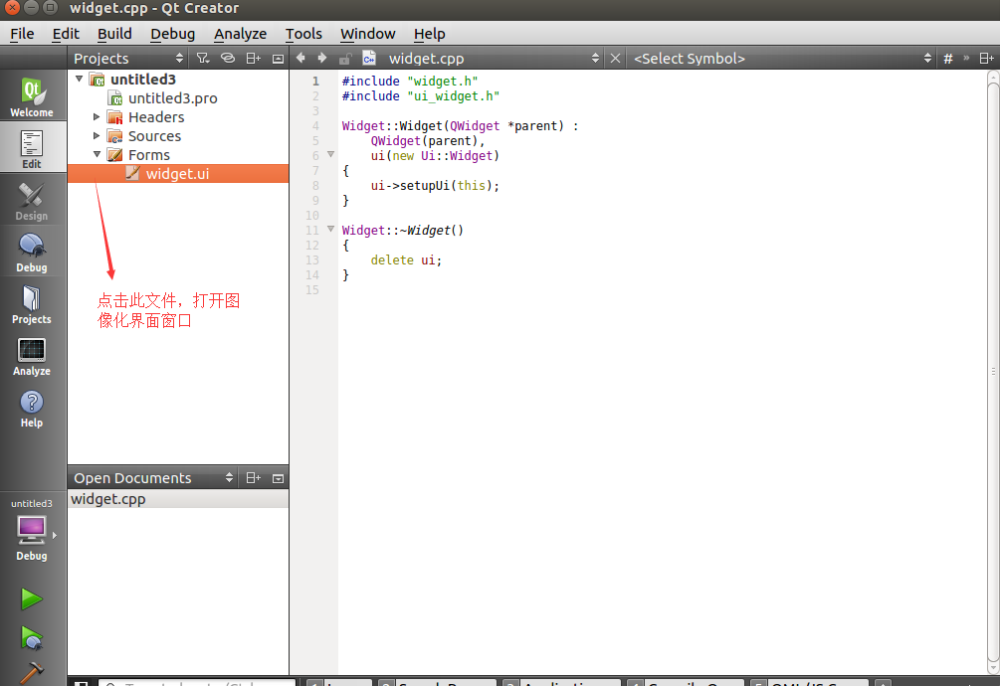
```sh
图 6.8 所示，在点击 XXX.ui开启QT编程界面
```

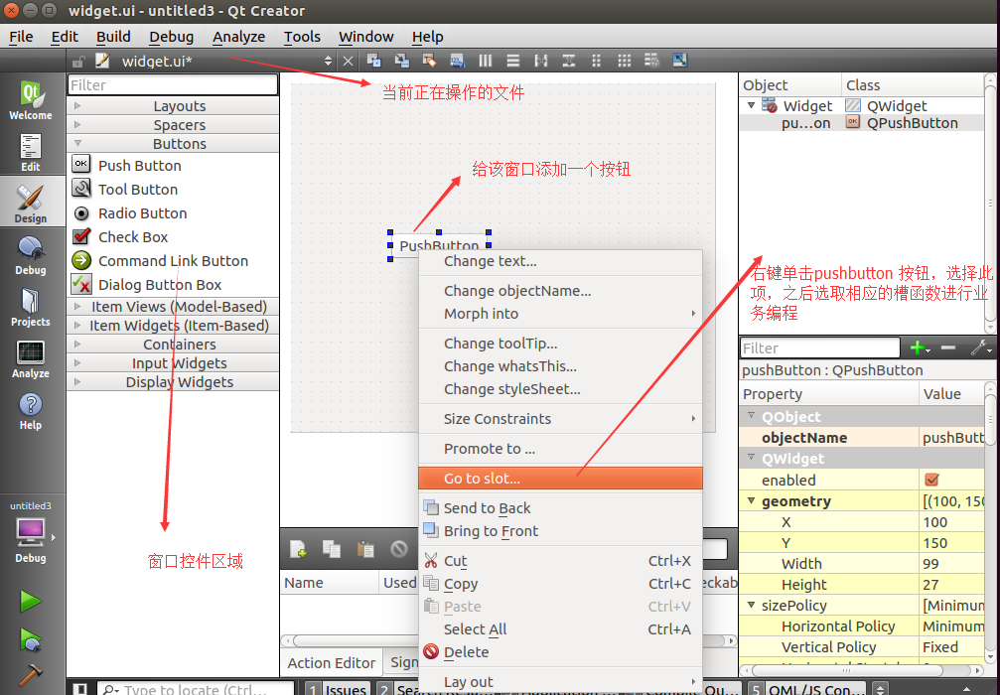
```sh
图 6.9 所示，在此页面进行UI界面的设计
```

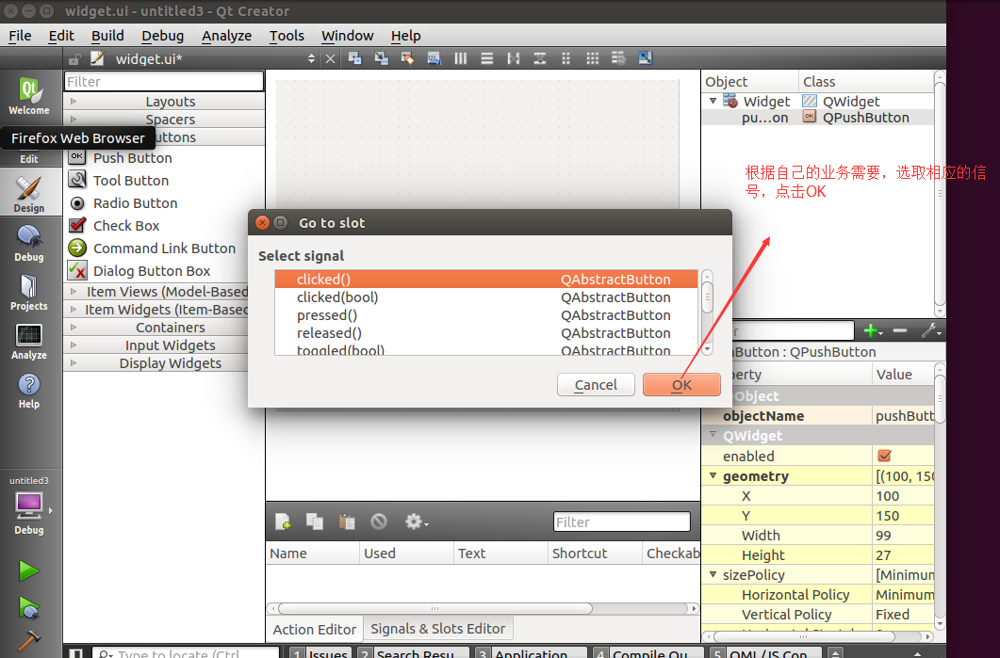
```sh
图 6.10所示，在此页面选取想要重载的控件的哪个槽函数
```

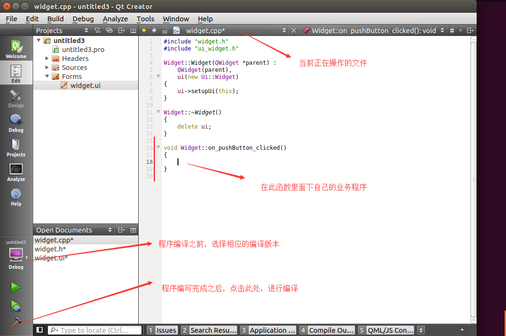
```sh
图 6.11所示，在此页面编写业务处理函数，点击左下角小锥子，可进行编译
```
