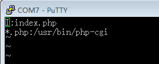
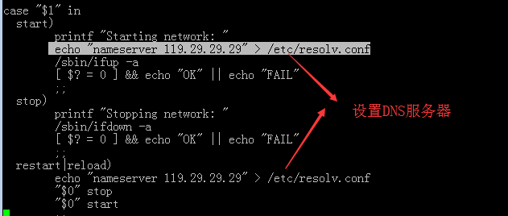

CMI_AT751 BSP

## arm常用工具配置说明


### 一、Httpd的配置与使用
* 在/etc 目录下（开发板）创建http的配置文件 httpd.conf，在httpd.conf文件中添加下面代码,如图1所示。

  
```sh
  图1 httpd.conf文件的内容
```

* 图1中两条语句的解释如下
```sh
  I:index.php ：指定httpd的默认网页主页文件
  *.php:/usr/bin/php-cgi ：指定PHP文件的解释器
```

* 修改PHP的配置文件/etc/php.ini，查找并修改如下两条内容，并且将这两句前面注释号去掉。
```sh
  cgi.force_redirect = 0
  cgi.redirect_status_env ="yes"
```

* 修改PHP的配置文件/etc/php.ini，查找并修改如下两条内容，并且将这两句前面注释号去掉。
```sh
  cgi.force_redirect = 0
  cgi.redirect_status_env ="yes"
```

* 在 /etc/init.d/ 下面创建httpd的启动脚本S71httpd，内容如下：
```sh
#! /bin/sh
set -e
DESC="httpd"
NAME=httpd
DAEMON=/usr/sbin/$NAME
case "$1" in
start)
      printf "Starting $DESC: "
      start-stop-daemon -S -b -x $NAME -- -h /var/www/SettingsPage-master/src
      echo "OK"
      ;;
stop)
      printf "Stopping $DESC: "
      start-stop-daemon -K -x $NAME
      echo "OK"
      ;;
restart|force-reload)
      echo "Restarting $DESC: "
      $0 stop
      sleep 1
      $0 start
      echo ""
      ;;
*)
      echo "Usage: $0 {start|stop|restart|force-reload}" >&2
      exit 1
      ;;
esac
exit 0
```

* 设置开发板静态IP，将/etc/network/interfaces 文件内容修改为如下：
```sh
auto eth0
iface eth0 inet static
address 192.167.5.100    
netmask 255.255.255.0
gateway 192.167.5.1
```

* 将以上配置设置完成后，重启开发板，使配置生效。


### 二、Vsftpd的配置与使用
* 简单配置Vsftpd的配置文件，在/etc/vsftpd.conf查找并修改成如下内容：
```sh
anonymous_enable=YES
local_enable=YES
write_enable=YES
local_umask=022
anon_root=/var/ftp
anon_upload_enable=YES
anon_mkdir_write_enable=YES
listen=YES
```
* 修改完配置文件后，在终端命令行输入服务重启命令（/etc/init.d/S70vsftpd restart）或重启开发板配置生效。
* vsftpd的使用如下:
```sh
客户端输入：ftp IP ；（例如： ftp 192.168.8.100）
输入用户名和密码（Root用户登录名：root，匿名用户登录名：anonymous）
```

### 三、Openssd的配置与使用
* 简单配置opensshd服务，打开/etc/ssh/sshd_config，查找下面条目做如下修改，修改完成后再终端输入重启命令（/etc/init.d/S50sshd restart）或者重启开发板使配置生效。
```sh
Port 22
AddressFamily any
ListenAddress 0.0.0.0
ListenAddress ::
PermitRootLogin yes
PasswordAuthentication yes
```


### 四、Ntp的配置与使用
* 把目标机当做ntp服务器使用，修改/etc/ntp.conf文件，内容如下：
```sh
指定上层服务器:格式如下：
server  IP （例如：server  1.cn.pool.ntp.org ）
b. 指定ntp自调整时间误差的文件，内容如下：
driftfile  /var/lib/ntp/drift
c. 预设的一个内部时钟资料，内容如下：
server    127.127.1.0     # 本地时钟
fudge     127.127.1.0  stratum 10 （本地时钟用在没有外部NTP服务器时，如果有外部ntp服务器，我们可以将它注解掉，stratum 10 表示将本机服务器设置为等级10,1级最大，16级最小。）
d. 设置客户端权限，格式如下；
restrict    [你的IP]    mask    [netmask_IP]     [parameter]
```

* 把目标机配置为客户端，修改/etc/ntp.conf文件，内容如下：
```sh
指定服务器:格式如下：
server  IP （例如：server  1.cn.pool.ntp.org ）
```

* 使用ntp工具更新系统时间：
```sh
ntpdate  server_ip  （例如：ntpdate  1.cn.pool.ntp.org ）
hwclock  –w    把系统时间写入硬件
```

* 时区的修改：
```sh
rm  /etc/localtime
ln  -s   /usr/share/zoneinfo/posix/Asia/Shanghai  /etc/localtime
```


### 五、设置开发板连接外网
* 设置动态IP，执行如下命令：
```sh
  udhcpc  eth0
```
* 设置静态IP，步骤如下:
```sh
1.设置本机IP：
2.设置本地网关（路由器IP）：
3.设置DNS服务器IP:
4.重启网卡：
参考第一章（静态ip的设置）。
```

* DNS服务器的设置，修改/etc/init.d/S40network，如下图所示：

  
```sh
  图2 设置dns服务器IP
```
